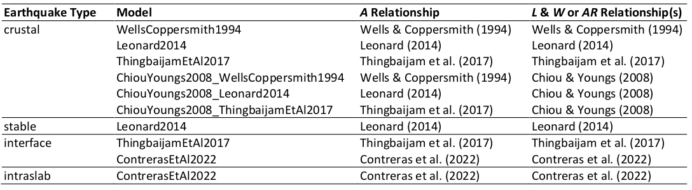
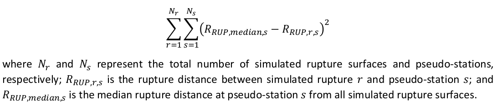
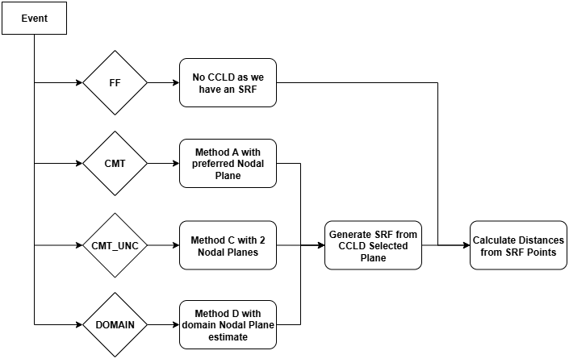
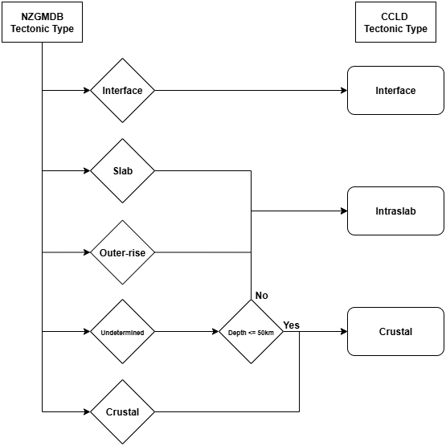

# 📐 Calculate Distances

This step determines the correct nodal plane information for each earthquake and calculates rupture distance (rrup) values for the propagation table. The implementation uses both Finite Fault models (SRF files) and the CCLD method to generate appropriate fault geometries for distance calculations.

---

## 🚀 Entry Point

To calculate distances between earthquake sources and stations, run the following Python script:

```bash
python -m nzgmdb.scripts.run_nzgmdb calculate-distances <main_dir>
```

- **<main_dir>** is the top-level output directory where NZGMDB stores its results.

Example:
```bash
python -m nzgmdb.scripts.run_nzgmdb calculate-distances nzgmdb_output/
```

Optional parameters include:
- `--n-procs`: Number of processes to use for parallel calculation (default: 1)

---

## 📋 Prerequisites

The Calculate Distances step requires the following inputs from previous pipeline steps:
- **[Merge IM Results](Merge-IM-Results.md)** - Provides the merged intensity measure data with event-station pairs (This is to optimize the distance calculation with only the even-station pairs that actually have processed results)

---

## ⚙️ Process

### 🔹 Event Categorization

For every event in the NZGMDB, a Rupture Plane is generated to compute rrup distances. Events are classified into four categories based on available information:

- **FF (Finite Fault)**: Events with directly available SRF files (e.g., Christchurch Feb 2011, Darfield, Kaikoura 2016) Total of 10
- **CMT (Centroid Moment Tensor)**: Events with a preferred nodal plane solution
- **CMT_UNC (CMT with Uncertainty)**: Events with two nodal plane solutions
- **Domain**: Events with only general tectonic domain information (strike, dip, rake)


*Example of a Finite Fault model for the Christchurch Feb 2011 Earthquake used for distance calculations*

### 🔹 CCLD Method

For events without direct SRF files, the NZGMDB utilizes the **(CCLD)** method, originally developed for NGA-West3, to determine optimal fault plane geometries.

#### Magnitude Scaling Relations

CCLD implements branching with different magnitude scaling relations to determine the area, aspect ratio, length and width of a nodal plane. The models used for each tectonic type are:


*Magnitude scaling relation models used by CCLD for different earthquake types*

#### CCLD Calculation Process

CCLD uses the following method to calculate the selected nodal plane for an event:

1. **Generate pseudo-station grid** around the fault plane
2. **Run Nr simulations** of fault planes and calculate rrup distances between each plane and every pseudo-station
3. **Find optimal nodal plane** that minimizes the following expression:


*Mathematical expression used to optimize nodal plane selection*

The pseudo-stations are distributed in a radial pattern around the fault to ensure comprehensive distance sampling:


*Example of pseudo-stations distributed around fault plane for CCLD calculation*

#### CCLD Categories

CCLD provides 5 different categories for nodal plane determination, each designed for different levels of available information:


*Illustration of different CCLD methods for various data availability scenarios*

**Category A & B**: Use preferred nodal plane (A = first plane, B = second plane)
- Maintains fixed strike, dip, and rake values
- Randomly samples area, aspect ratio, and hypocenter locations

**Category C**: Two nodal plane solutions, no preference
- 50/50 random selection between nodal planes in each simulation
- Randomly samples area, aspect ratio, and hypocenter locations

**Category D**: Single nodal plane with uncertainty
- Strike adjusted by ±30°, dip by ±10° in each simulation
- Rake determines rupture mechanism
- Randomly samples area, aspect ratio, and hypocenter locations

**Category E**: No nodal plane information
- All parameters (strike, dip, rake, area, aspect ratio, hypocenter) randomly sampled

### 🔹 NZGMDB Implementation

#### Event Category Mapping

The NZGMDB uses 3 CCLD categories (A, C, and D) mapped to the available event information:



*Mapping of NZGMDB event categories to CCLD methods*

#### Tectonic Type Mapping

The NZGMDB's 5 tectonic types are mapped to CCLD's 3 tectonic regimes:



*Mapping between NZGMDB and CCLD tectonic classifications*

### 🔹 Nodal Plane Determination

The system determines the correct nodal plane through the following hierarchy:

1. **Check SRF Files**: If event ID matches pre-existing SRF files (Christchurch Feb 2011, Darfield, Kaikoura 2016, etc.):
   - Load SRF file directly
   - Extract nodal plane parameters and SRF points
   - Calculate weighted average of strike, dip, rake based on plane areas

2. **Check Modified CMT Solutions** (Custom review for most likely nodal plane):
   - Use predetermined preferred nodal plane
   - Extract strike, dip, rake values
   - Apply CCLD Method A

3. **Check Standard CMT Solutions**: Search GeoNet CMT catalog:
   - Apply CCLD Method C with both nodal planes

4. **Use Domain Default**: For events without CMT solutions:
   - Apply tectonic domain-specific strike, dip, rake values
   - Use CCLD Method D with domain parameters

### 🔹 Distance Calculations

Once fault geometry is established, the system calculates multiple distance metrics:

#### Primary Distance Metrics
- **rrup**: Closest distance to rupture surface (km)
- **rjb**: Joyner-Boore distance (closest distance to surface projection of rupture, km)
- **rx**: Distance measured perpendicular to fault strike (km)
- **ry**: Distance measured parallel to fault strike (km)

#### Additional Distance Metrics
- **r_epis**: Epicentral distance (km)
- **r_hyps**: Hypocentral distance (km)
- **azs**: Source-to-site azimuth (degrees)
- **b_azs**: Back azimuth (degrees)

#### Volcanic Zone Metrics
- **tvz_length**: Length of ray path through Taupo Volcanic Zone (km)
- **boundary_dists_rjb**: Distance from station to Taupo Volcanic Zone boundary (km)

### 🔹 SRF Point Generation

For events without pre-existing SRF files:

1. **Generate coordinate mesh** using fault length, width, strike, and dip
2. **Create SRF points** at specified resolution (configurable via `points_per_km`)
3. **Apply corner coordinates** from CCLD-determined fault geometry

---

## ⚙️ Configuration Parameters

Key parameters from `config.yaml` that control distance calculations:

### 🔹 Coordinate Systems
- `ll_num`: WGS84 coordinate system identifier
- `nztm_num`: NZTM coordinate system identifier

### 🔹 Fault Discretization
- `points_per_km`: Resolution for SRF point generation (default: typically 2-4 points/km)

### 🔹 External Data Sources
- `cmt_url`: URL for GeoNet CMT solutions catalog

---

## 📦 Output

### 🔹 Propagation Table
The main output is a comprehensive CSV file containing distance metrics for every event-station pair:

**File Location**: `flatfiles/propagation_table.csv`

**Key Columns**

| Column                | Description                         | Units    |
|-----------------------|-------------------------------------|----------|
| `evid`                | Event identifier                    | -        |
| `station`             | Station code                        | -        |
| `rrup`                | Closest distance to rupture         | km       |
| `rjb`                 | Joyner-Boore distance               | km       |
| `rx`                  | Distance perpendicular to strike    | km       |
| `ry`                  | Distance parallel to strike         | km       |
| `r_epis`              | Epicentral distance                 | km       |
| `r_hyps`              | Hypocentral distance                | km       |
| `azs`                 | Source-to-site azimuth              | degrees  |
| `b_azs`               | Back azimuth                        | degrees  |
| `tvz_length`          | Path length through Taupo VZ        | km       |
| `boundary_dists_rjb`  | Distance to Taupo VZ boundary       | km       |


### 🔹 Enhanced Earthquake Source Table
Additional fault parameters are merged into the earthquake source table:

**New Columns Added**

| Column     | Description                 | Units   |
|------------|-----------------------------|---------|
| `strike`   | Fault strike angle          | degrees |
| `dip`      | Fault dip angle             | degrees |
| `rake`     | Fault rake angle            | degrees |
| `f_length` | Fault length along strike   | km      |
| `f_width`  | Fault width down dip        | km      |
| `f_type`   | Source of fault geometry    | -       |
| `z_tor`    | Depth to top of rupture     | km      |
| `z_bor`    | Depth to bottom of rupture  | km      |


**Fault Type (f_type) Classifications**:
- `ff`: Finite fault (from SRF file)
- `cmt`: Centroid moment tensor (preferred plane)
- `cmt_unc`: CMT with uncertainty (two planes)
- `domain`: Tectonic domain default values

### 🔹 Geometry Source Table

Additional geometry information is stored in a separate table for each of the planes used in the distance calculations (Some Faults like the FF Models have multiple planes):

**Geometry Output Columns**

| Column            | Description                                     | Units    |
|-------------------|-------------------------------------------------|----------|
| `evid`            | Event identifier                                | -        |
| `plane_id`        | Identifier for fault plane (starting from 1)    | -        |
| `f_type`          | Source of fault geometry                        | -        |
| `strike`          | Fault strike angle                              | degrees  |
| `dip`             | Fault dip angle                                 | degrees  |
| `rake`            | Fault rake angle                                | degrees  |
| `f_length`        | Fault length along strike                       | km       |
| `f_width`         | Fault width down dip                            | km       |
| `z_tor`           | Depth to top of rupture                         | km       |
| `z_bor`           | Depth to bottom of rupture                      | km       |
| `hyp_lat`         | Hypocenter latitude                             | degrees  |
| `hyp_lon`         | Hypocenter longitude                            | degrees  |
| `hyp_strike`      | Strike of hypocenter plane (if applicable)      | degrees  |
| `hyp_dip`         | Dip of hypocenter plane (if applicable)         | degrees  |
| `corner_0_lat`    | Latitude of top-left corner of fault plane      | degrees  |
| `corner_0_lon`    | Longitude of top-left corner of fault plane     | degrees  |
| `corner_0_depth`  | Depth of top-left corner                        | km       |
| `corner_1_lat`    | Latitude of top-right corner of fault plane     | degrees  |
| `corner_1_lon`    | Longitude of top-right corner of fault plane    | degrees  |
| `corner_1_depth`  | Depth of top-right corner                       | km       |
| `corner_2_lat`    | Latitude of bottom-right corner of fault plane  | degrees  |
| `corner_2_lon`    | Longitude of bottom-right corner of fault plane | degrees  |
| `corner_2_depth`  | Depth of bottom-right corner                    | km       |
| `corner_3_lat`    | Latitude of bottom-left corner of fault plane   | degrees  |
| `corner_3_lon`    | Longitude of bottom-left corner of fault plane  | degrees  |
| `corner_3_depth`  | Depth of bottom-left corner                     | km       |


---

## 🔧 Performance Optimization

### 🔹 Parallel Processing
- Distance calculations are parallelized by event
- Use `--n-procs` parameter to optimize for available CPU cores
- Memory usage scales with number of simultaneous events processed

### 🔹 Computational Efficiency
- Vectorized distance calculations using NumPy
- Optimized triangle-to-point distance algorithms for complex fault geometries
- Efficient spatial queries using Shapely geometric operations

---

## ⚠️ Important Notes

- **Data Quality**: Distance accuracy depends on the quality of available nodal plane information
- **CCLD Uncertainty**: For events using CCLD methods, distances incorporate inherent uncertainties from the simulation process
- **Coordinate Systems**: All calculations performed in NZTM projection for accuracy within New Zealand
- **Volcanic Zone**: Special handling for paths crossing the Taupo Volcanic Zone affects regional GMPEs

---

## 🔗 Related Steps

- **Previous**: [Merge IM Results](Merge-IM-Results.md) - Provides the event-station pairs requiring distance calculations
- **Next**: [Merge Flatfiles](Merge-Flatfiles.md) - Combines distance data with intensity measures for final output
- **Related**: [Add Tectonic Domain](Add-Tectonic-Domain.md) - Provides tectonic classifications used in CCLD method selection
- **Related**: [IM Calculation](IM-Calculation.md) - Uses distance metrics for intensity measure computation