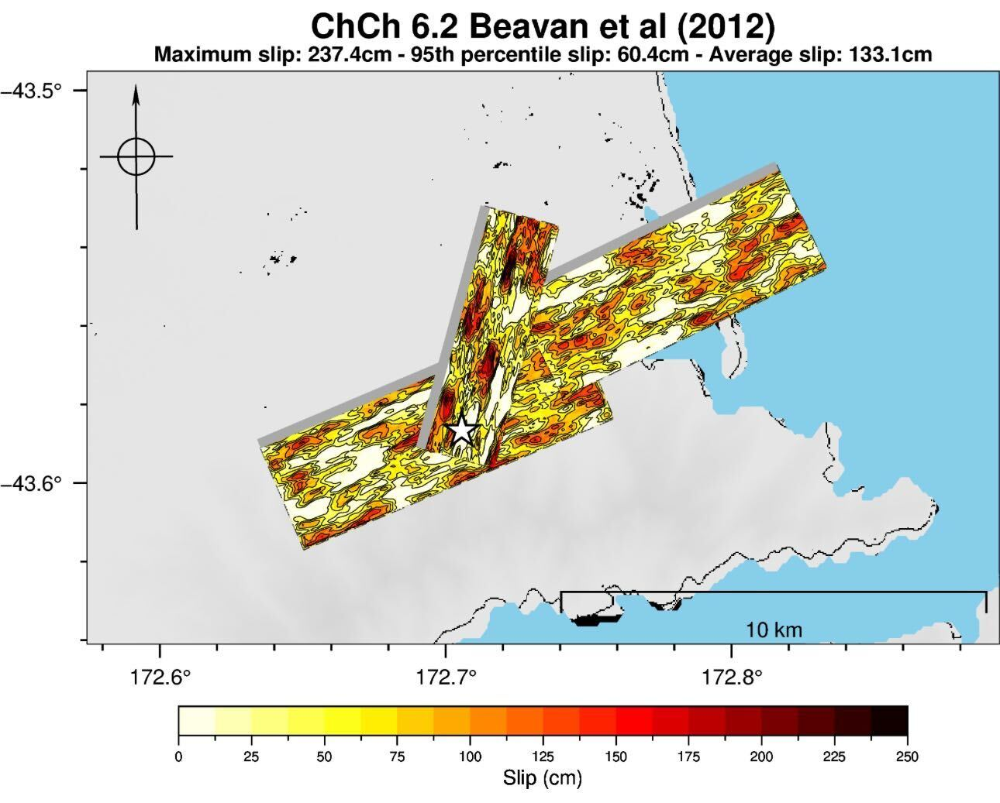
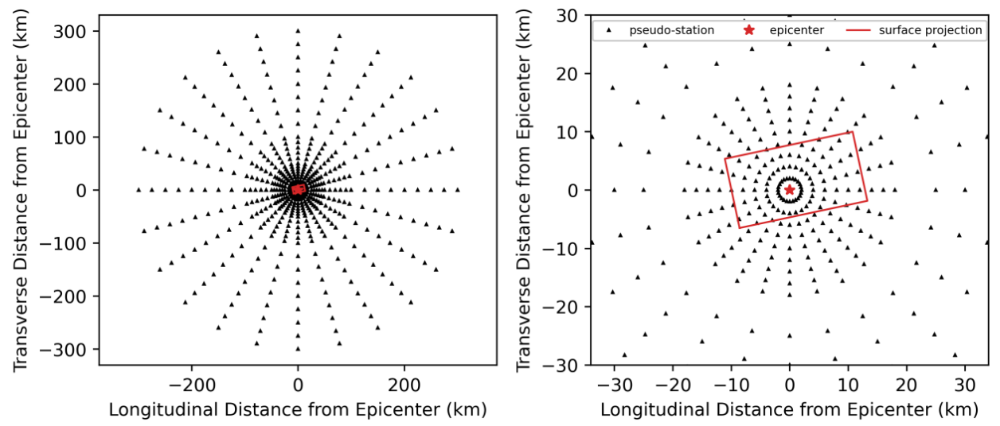
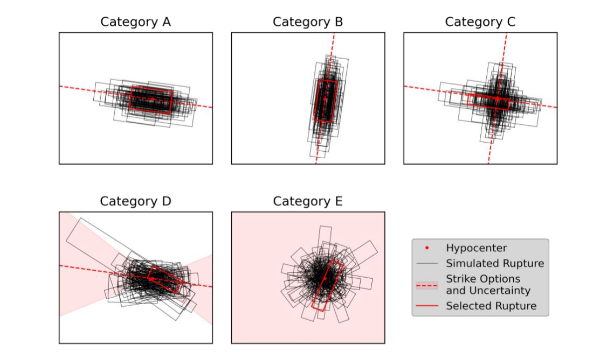
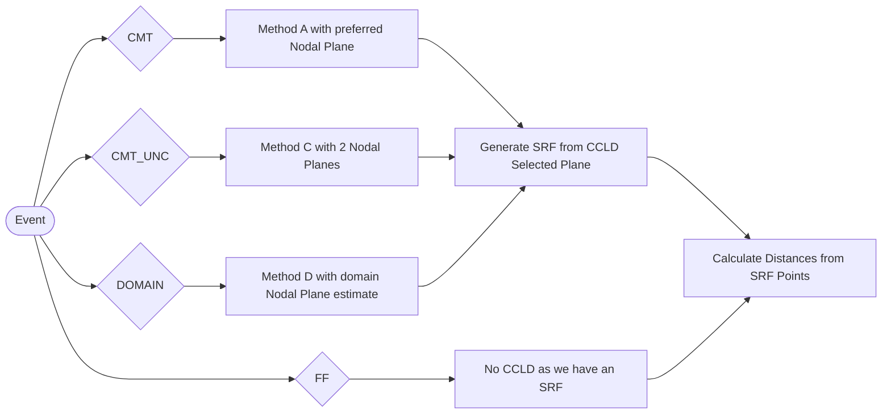
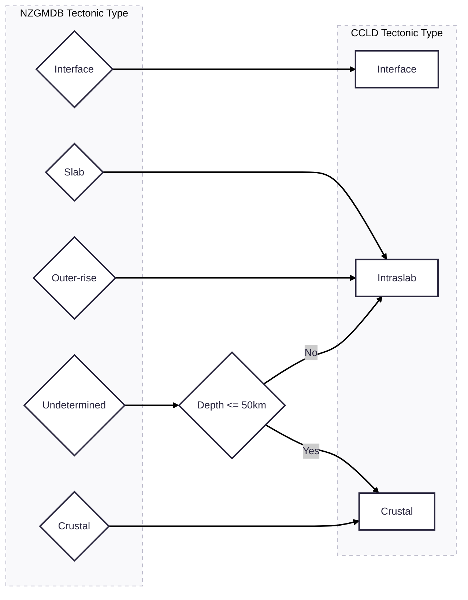

# 📐 Calculate Distances

This step determines the correct nodal plane information for each earthquake and calculates rupture distance (rrup) values for the propagation table. The implementation uses both Finite Fault models (SRF files) and the CCLD method to generate appropriate fault geometries for distance calculations.

---

## 🚀 Entry Point

To calculate distances between earthquake sources and stations, run the following Python script:

```bash
python -m nzgmdb.scripts.run_nzgmdb calculate-distances <main_dir>
```

- **<main_dir>** is the top-level output directory where NZGMDB stores its results.

Example:
```bash
python -m nzgmdb.scripts.run_nzgmdb calculate-distances nzgmdb_output/
```

Optional parameters include:
- `--n-procs`: Number of processes to use for parallel calculation (default: 1)

---

## 📋 Prerequisites

The Calculate Distances step requires the following inputs from previous pipeline steps:
- **[Merge IM Results](Merge-IM-Results.md)** - Provides the merged intensity measure data with event-station pairs (This is to optimise the distance calculation with only the even-station pairs that actually have processed results)

---

## ⚙️ Process

### 🔹 Event optimised

For every event in the NZGMDB, a rupture plane is generated to compute rrup distances. Events are classified into four categories based on available information:

- **FF (Finite Fault)**: Events with directly available SRF files (e.g., Christchurch Feb 2011, Darfield, Kaikoura 2016) total of 10
- **CMT (Centroid Moment Tensor)**: Events with a preferred nodal plane solution
- **CMT_UNC (CMT with Uncertainty)**: Events with two nodal plane solutions
- **Domain**: Events with only general tectonic domain information (strike, dip, rake)


*Example of a finite fault model for the Christchurch Feb 2011 Earthquake used for distance calculations*

### 🔹 CCLD Method

For events without direct SRF files, the NZGMDB utilises the [CCLD](https://zenodo.org/records/13380672) method, originally developed for NGA-West3, to determine optimal fault plane geometries.

#### Magnitude Scaling Relations

CCLD implements branching with different magnitude scaling relations to determine the area, aspect ratio, length and width of a nodal plane. The models used for each tectonic type are:


| **Earthquake Type** | **Model**                             | **A Relationship**         | **L & W or AR Relationship(s)** |
|---------------------|---------------------------------------|----------------------------|---------------------------------|
| crustal             | WellsCoppersmith1994                  | Wells & Coppersmith (1994) | Wells & Coppersmith (1994)      |
|                     | Leonard2014                           | Leonard (2014)             | Leonard (2014)                  |
|                     | ThingbaijamEtAl2017                   | Thingbaijam et al. (2017)  | Thingbaijam et al. (2017)       |
|                     | ChiouYoungs2008\_WellsCoppersmith1994 | Wells & Coppersmith (1994) | Chiou & Youngs (2008)           |
|                     | ChiouYoungs2008\_Leonard2014          | Leonard (2014)             | Chiou & Youngs (2008)           |
|                     | ChiouYoungs2008\_ThingbaijamEtAl2017  | Thingbaijam et al. (2017)  | Chiou & Youngs (2008)           |
| stable              | Leonard2014                           | Leonard (2014)             | Leonard (2014)                  |
| interface           | ThingbaijamEtAl2017                   | Thingbaijam et al. (2017)  | Thingbaijam et al. (2017)       |
|                     | ContrerasEtAl2022                     | Contreras et al. (2022)    | Contreras et al. (2022)         |
| intraslab           | ContrerasEtAl2022                     | Contreras et al. (2022)    | Contreras et al. (2022)         |
*Magnitude scaling relation models used by CCLD for different earthquake types*

#### CCLD Calculation Process

CCLD uses the following method to calculate the selected nodal plane for an event:

1. **Generate pseudo-station grid** around the fault plane
2. **Run Nr simulations** of fault planes and calculate rrup distances between each plane and every pseudo-station
3. **Find optimal nodal plane** that minimises the following expression:


$$\sum_{r=1,s=1}^{N_r} \sum_{s=1}^{N_s} (R_{RUP,median,s} - R_{RUP,r,s})^2,$$
where $N_r$ and $N_s$ represent the number of simulated surface ruptures and pseudo-stations, respectively; $R_{RUP,r,s}$ is the rupture distance between a simulated rupture $r$ and pseudo-station $s$; and $R_{RUP,median,s} is the median rupture distance at pseudo-station $s$ from all simulated rupture surfaces.

The pseudo-stations are distributed in a radial pattern around the fault to ensure comprehensive distance sampling:


*Example of pseudo-stations distributed around fault plane for CCLD calculation*

#### CCLD Categories

CCLD provides 5 different categories for nodal plane determination, each designed for different levels of available information:


*Illustration of different CCLD methods for various data availability scenarios*

**Category A & B**: Use preferred nodal plane (A = first plane, B = second plane)
- Maintains fixed strike, dip, and rake values
- Randomly samples area, aspect ratio, and hypocentre locations

**Category C**: Two nodal plane solutions, no preference
- 50/50 random selection between nodal planes in each simulation
- Randomly samples area, aspect ratio, and hypocentre locations

**Category D**: Single nodal plane with uncertainty
- Strike adjusted by ±30°, dip by ±10° in each simulation
- Rake determines rupture mechanism
- Randomly samples area, aspect ratio, and hypocentre locations

**Category E**: No nodal plane information
- All parameters (strike, dip, rake, area, aspect ratio, hypocentre) randomly sampled

### 🔹 NZGMDB Implementation

#### Event Category Mapping

The NZGMDB uses 3 CCLD categories (A, C, and D) mapped to the available event information:


```mermaid
flowchart LR
    Event([Event])
    
    FF{FF}
    CMT{CMT}
    CMT_UNC{CMT_UNC}
    DOMAIN{DOMAIN}
    
    FF --> NoCCLD["No CCLD as we have an SRF"]
    CMT --> MethodA["Method A with preferred Nodal Plane"]
    CMT_UNC --> MethodC["Method C with 2 Nodal Planes"]
    DOMAIN --> MethodD["Method D with domain Nodal Plane estimate"]
    
    MethodA --> GenSRF["Generate SRF from CCLD Selected Plane"]
    MethodC --> GenSRF
    MethodD --> GenSRF
    
    GenSRF --> CalcDist["Calculate Distances from SRF Points"]
    NoCCLD --> CalcDist
    
    Event --> FF
    Event --> CMT
    Event --> CMT_UNC
    Event --> DOMAIN
```

*Mapping of NZGMDB event categories to CCLD methods*

#### Tectonic Type Mapping

The NZGMDB's 5 tectonic types are mapped to CCLD's 3 tectonic regimes:


```mermaid
---
config:
      theme: redux
---
flowchart LR
    subgraph NZGMDB_Tectonic_Type["NZGMDB Tectonic Type"]
        direction TB
        Interface{Interface}
        Slab{Slab}
        Outerrise{Outer-rise}
        Undetermined{Undetermined}
        Crustal{Crustal}
    end
    classDef dashed stroke-dasharray: 5 5
    class NZGMDB_Tectonic_Type dashed
    subgraph CCLD_Tectonic_Type["CCLD Tectonic Type"]
        direction TB
        CCLD_Interface[Interface]
        CCLD_Intraslab[Intraslab]
        CCLD_Crustal[Crustal]
    end
    class CCLD_Tectonic_Type dashed
    Interface --> CCLD_Interface
    Slab --> CCLD_Intraslab
    Outerrise --> CCLD_Intraslab
    Crustal --> CCLD_Crustal
    Undetermined --> DepthCheck{Depth <= 50km}
    DepthCheck -- Yes --> CCLD_Crustal
    DepthCheck -- No --> CCLD_Intraslab
```

*Mapping between NZGMDB and CCLD tectonic classifications*

### 🔹 Nodal Plane Determination

The system determines the correct nodal plane through the following hierarchy:

1. **Check SRF Files**: If event ID matches pre-existing SRF files (Christchurch Feb 2011, Darfield, Kaikoura 2016, etc.):
   - Load SRF file directly
   - Extract nodal plane parameters and SRF points
   - Calculate weighted average of strike, dip, rake based on plane areas

2. **Check Modified CMT Solutions** (Custom review for most likely nodal plane):
   - Use predetermined preferred nodal plane
   - Extract strike, dip, rake values
   - Apply CCLD Method A

3. **Check Standard CMT Solutions**: Search GeoNet CMT catalogue:
   - Apply CCLD Method C with both nodal planes

4. **Use Domain Default**: For events without CMT solutions:
   - Apply tectonic domain-specific strike, dip, rake values
   - Use CCLD Method D with domain parameters

### 🔹 Distance Calculations

Once fault geometry is established, the system calculates multiple distance metrics which are briefly summarised below, some more documentation / figures of these metrics can be found [here](https://pubs.geoscienceworld.org/eeri/earthquake-spectra/article/27/4/1219/586831/Estimating-Unknown-Input-Parameters-when).

#### Primary Distance Metrics
- **r_rup**: Closest distance to rupture surface (km)
- **r_jb**: Joyner-Boore distance (closest distance to surface projection of rupture, km)
- **r_avg**: Average closest distance to all rupture plane areas (km)
- **r_x**: Distance measured perpendicular to fault strike (km)
- **r_y**: Distance measured parallel to fault strike (km)

#### Additional Distance Metrics
- **r_epi**: Epicentral distance (km)
- **r_hyp**: Hypocentral distance (km)
- **az**: Source-to-site azimuth (degrees)
- **b_az**: Back azimuth (degrees)

#### Volcanic Zone Metrics
- **r_tvz**: Length of ray path through Taupo Volcanic Zone (km)
- **r_xvf**: Distance from station to Taupo Volcanic Zone boundary (km)

### 🔹 SRF Point Generation

For events without pre-existing SRF files:

1. **Generate coordinate mesh** using fault length, width, strike, and dip
2. **Create SRF points** at specified resolution (configurable via `points_per_km`)
3. **Apply corner coordinates** from CCLD-determined fault geometry

---

## ⚙️ Configuration Parameters

Key parameters from `config.yaml` that control distance calculations:

### 🔹 Coordinate Systems
- `ll_num`: WGS84 coordinate system identifier
- `nztm_num`: NZTM coordinate system identifier

### 🔹 Fault Discretisation
- `points_per_km`: Resolution for SRF point generation (default: typically 2-4 points/km)

### 🔹 External Data Sources
- `cmt_url`: URL for GeoNet CMT solutions catalogue

---

## 📦 Output

### 🔹 Propagation Table
The main output is a comprehensive CSV file containing distance metrics for every event-station pair:

**File Location**: `flatfiles/propagation_table.csv`

**Key Columns**

| Column   | Description                               | Units   |
|----------|-------------------------------------------|---------|
| `evid`   | Event identifier                          | -       |
| `net`    | Network identifier                        | -       |
| `sta`    | Station code                              | -       |
| `r_epi`  | Epicentral distance                       | km      |
| `r_hyp`  | Hypocentral distance                      | km      |
| `r_jb`   | Joyner-Boore distance                     | km      |
| `r_rup`  | Closest distance to rupture               | km      |
| `r_avg`  | Average Closest distance to rupture plane | km      |
| `r_x`    | Distance perpendicular to strike          | km      |
| `r_y`    | Distance parallel to strike               | km      |
| `r_tvz`  | Path length through Taupo VZ              | km      |
| `r_xvf`  | Distance to Taupo VZ boundary             | km      |
| `az`     | Source-to-site azimuth                    | degrees |
| `b_az`   | Back azimuth                              | degrees |
| `f_type` | Source of fault geometry                  | -       |
| `reloc`  | Defines if earthquake was relocated       | -       |


### 🔹 Enhanced Earthquake Source Table
Additional fault parameters are merged into the earthquake source table:

**New Columns Added**

| Column     | Description                 | Units   |
|------------|-----------------------------|---------|
| `strike`   | Fault strike angle          | degrees |
| `dip`      | Fault dip angle             | degrees |
| `rake`     | Fault rake angle            | degrees |
| `f_length` | Fault length along strike   | km      |
| `f_width`  | Fault width down dip        | km      |
| `f_type`   | Source of fault geometry    | -       |
| `z_tor`    | Depth to top of rupture     | km      |
| `z_bor`    | Depth to bottom of rupture  | km      |


**Fault Type (f_type) Classifications**:
- `ff`: Finite fault (from SRF file)
- `cmt`: Centroid moment tensor (preferred plane)
- `cmt_unc`: CMT with uncertainty (two planes)
- `domain`: Tectonic domain default values

### 🔹 Geometry Source Table

Additional geometry information is stored in a separate table for each of the planes used in the distance calculations (Some Faults like the FF Models have multiple planes):

**File Location**: `flatfiles/earthquake_source_geometry.csv`

**Geometry Output Columns**

| Column            | Description                                     | Units   |
|-------------------|-------------------------------------------------|---------|
| `evid`            | Event identifier                                | -       |
| `plane_id`        | Identifier for fault plane (starting from 1)    | -       |
| `f_type`          | Source of fault geometry                        | -       |
| `strike`          | Fault strike angle                              | degrees |
| `dip`             | Fault dip angle                                 | degrees |
| `rake`            | Fault rake angle                                | degrees |
| `f_length`        | Fault length along strike                       | km      |
| `f_width`         | Fault width down dip                            | km      |
| `z_tor`           | Depth to top of rupture                         | km      |
| `z_bor`           | Depth to bottom of rupture                      | km      |
| `hyp_lat`         | Hypocentre latitude                             | degrees |
| `hyp_lon`         | Hypocentre longitude                            | degrees |
| `hyp_depth`       | Hypocentre depth                                | km      |
| `hyp_strike`      | The location of the hypocentre along-strike (expressed as a proportion of fault length).           | 0-1     |
| `hyp_dip`         | The location of the hypocentre down-dip (expressed as a proportion of fault length).               | 0-1     |
| `corner_0_lat`    | Latitude of top-left corner of fault plane      | degrees |
| `corner_0_lon`    | Longitude of top-left corner of fault plane     | degrees |
| `corner_0_depth`  | Depth of top-left corner                        | km      |
| `corner_1_lat`    | Latitude of top-right corner of fault plane     | degrees |
| `corner_1_lon`    | Longitude of top-right corner of fault plane    | degrees |
| `corner_1_depth`  | Depth of top-right corner                       | km      |
| `corner_2_lat`    | Latitude of bottom-right corner of fault plane  | degrees |
| `corner_2_lon`    | Longitude of bottom-right corner of fault plane | degrees |
| `corner_2_depth`  | Depth of bottom-right corner                    | km      |
| `corner_3_lat`    | Latitude of bottom-left corner of fault plane   | degrees |
| `corner_3_lon`    | Longitude of bottom-left corner of fault plane  | degrees |
| `corner_3_depth`  | Depth of bottom-left corner                     | km      |


---

## 🔧 Performance Optimisation

### 🔹 Parallel Processing
- Distance calculations are parallelised by event
- Use `--n-procs` parameter to optimise for available CPU cores

### 🔹 Computational Efficiency
- Vectorised distance calculations using NumPy

---

## ⚠️ Important Notes

- **Data Quality**: Distance accuracy depends on the quality of available nodal plane information
- **CCLD Uncertainty**: For events using CCLD method C, between each run, the nodal planes are randomly selected, which introduces variability in the results each time the distances are calculated
- **Coordinate Systems**: All calculations performed in NZTM projection for accuracy within New Zealand

---

## 🔗 Related Steps

- **Previous**: [Merge IM Results](Merge-IM-Results.md) - Provides the event-station pairs requiring distance calculations
- **Next**: [Merge Aftershocks](Merge-Aftershocks.md) - Merges aftershock classifications and cluster labels into the earthquake source table
- **Related**: [Add Tectonic Domain](Add-Tectonic-Domain.md) - Provides tectonic classifications used in CCLD method selection