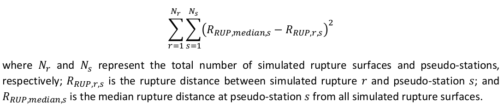

Determines correct nodal plane, calculates rrup values for propagation table

# Prerequisites

- Merged IM data

# Process

For every event in the NZGMDB an SRF is generated to then be used to compute the rrup distances.
The SRF is generated different ways based on the information available for the event.

Events from the NZGMDB fall under 4 Categories.

- FF: Finite Fault (We directly have an SRF generated for this)
- CMT: Centroid Moment Tensor (We have a preferred nodal plane for this)
- CMT_UNC: Centroid Moment Tensor with Uncertainty (We have 2 Nodal Plane Solutions)
- Domain: General Domain (We have no nodal plane information, except for the general domain strike, dip and rake)

For Finite Faults we can use the SRF directly, but for the other methods we utilise a method used by NGA-West3 called CCLD which is explained below and how we map our other 3 categories to their approaches.

## CCLD Method

### Magnitude Scaling Relations

CCLD implements branching with different magnitude scaling relations to determine the Area, Aspect Ratio, Length and Width of a nodal plane.
The models used for each Tectonic type are described in the image below:

### Calculation for selected Plane

CCLD uses the following method to calculate the selected nodal plane for an event:

- Generate a grid of pseudo-stations around the fault plane
- Generate Nr simulations of fault planes and calculate rrup distances between the plane and every "station"
- Finds the optimal nodal plane that minimizes the following expression:

Below is an image that shows an example of pseudo-stations distributed around the fault plane that is then used in the calculation to find the selected nodal plane.

### Categories
CCLD has 5 different categories for getting the nodal Plane which are meant to be used differently depending on the information you have available to you.

Category A and B both use the same method for getting the nodal plane and are meant to be used if there is 1 nodal plane that is preferred between 2 possible, A uses the first plane and B uses the second plane.
This method keeps the strike, dip and rake values the same as the preferred nodal plane, but the area, aspect ratio and hypocentre locations are randomly selected from the distributions.

Category C if you have 2 nodal plane solutions but neither is preferred. In this case in each simulation a coin is flipped 50/50 for which plane is selected but, still the area, aspect ratio and hypocentre locations are randomly selected from the distributions.

Category D is used if you have just 1 nodal plane solution but there is uncertainty in the strike, dip and rake values. In this case the strike is adjusted in each simulation by +-30 degrees, dip by +-10 degrees and rake is used to determine the rupture mechanism. The area, aspect ratio and hypocentre locations are also randomly selected from the distributions.

Category E is used when you have 0 nodal plane information and so the strike, dip and rake are randomly selected from the distributions as well as the area, aspect ratio and hypocentre locations.

Below is an image that shows an illustration of the different methods.

### Mappings to CCLD

In the NZGMDB we make use of 3 categories (A, C and D). Below is an image that shows the mapping of each event category to the CCLD method.

There also is a Tectonic type mapping to CCLD. The NZGMDB has 5 Tecotonic types and CCLD has 3. To map them we did the following shown in the image below.

## SRF points to rrup
From this if the srf points are not already provided from the srf files then a grid of points are generated using the length and width and the strike and dip values.

Once srf points are guaranteed then the rrup values are calculated for each station and the event and stored in a dataframe.
This also includes rjb and then rx and ry are calculated using the closest points on the srf to the station.

A few other distance metrics are calculated such as 
- r_epis
- r_hyps
- azs
- b_azs
- tvz_length
- boundary_dists_rjb

Where tvz_length and boundary_dists_rjb are dealing with the volcanic zone region information.
# Output

All of this data is added to a propagation dataframe which is then saved as a csv file which contains every event and site pair.
Extra event data such as strike, dip, rake, f_length, f_width, f_type, z_tor and z_bor are added to the earthquake source table based on results done during this calculation.

## Determines the correct nodal plane
To determine the correct nodal plane (strike, dip and rake), the following is done for every event:

- Checks if the event id is within the set of srf files that define specific earthquakes such as Christchurch Feb 2011 and Darfield as well as Kaikoura 2016.
If the event id is within this set then it loads the srf files and gets the nodal plane information as well as the srf points from the srf directly and then moves on to the rrup calculations.

- Otherwise it checks the modified CMT solutions file "GeoNet_CMT_solutions_20201129_PreferredNodalPlane_v1.csv" as these have been
previously determined for the 1st nodal plane being correct and so strike dip and rake are extracted from this file.

- If the event is in neither of these then it checks the general CMT solutions file which is fetched directly from Geonet's GitHub repo.
A function called mech_rot is then applied which checks which nodal plane is as close to the region specific strike as possible and then selects that nodal plane for strike dip and rake.
The code for this function can be found [here](https://github.com/ucgmsim/nzgmdb/blob/2fa80fa0917989c1103ed0a1e4821be7bb8f0e73/nzgmdb/calculation/distances.py#L61).

- If still the event is in none of these then the general domain strike dip and rake is used which is determined by this file "focal_mech_tectonic_domain_v1.csv"
