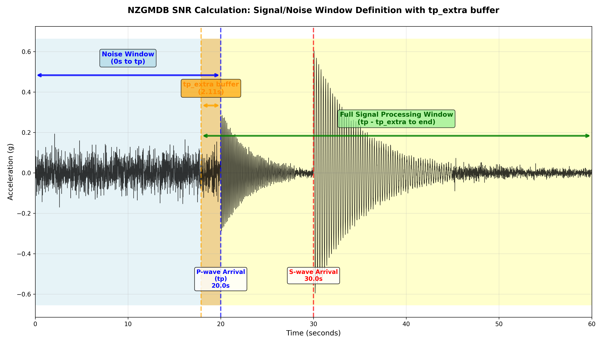

# 📊 Calculate SNR

This step in the NZGMDB pipeline computes Signal-to-Noise Ratio (SNR) and Fourier Amplitude Spectra (FAS) files for seismic waveforms.

---

## 🚀 Entry Point

To calculate SNR for all waveform data, run the following Python script:

```bash
python -m nzgmdb.scripts.run_nzgmdb calculate-snr <main_dir>
```

- **<main_dir>** is the top-level output directory where NZGMDB stores its results.

Example:
```bash
python -m nzgmdb.scripts.run_nzgmdb calculate-snr nzgmdb_output/
```

This will process all MSEED files and create SNR/FAS outputs in:

```bash
nzgmdb_output/snr_fas/year/event_id/evid_station_channel_location_snr_fas.csv
```

---

## 📋 Prerequisites

The Calculate SNR step requires the following inputs from previous pipeline steps:
- **[Parse Geonet](https://github.com/ucgmsim/nzgmdb/wiki/Parse-Geonet)** (generates MSEED files in the waveforms directory)
- **[Phase Arrival](https://github.com/ucgmsim/nzgmdb/wiki/Phase-Arrival)** (produces phase arrival table with P-wave arrival times)

---

## ⚙️ Process

### 🔹 Common Frequency Vector

All SNR calculations are performed using a vector of 389 frequencies logarithmically spaced between 0.01318257 Hz and 100 Hz.

This ensures consistent frequency sampling across all records for downstream analysis.

### 🔹 Waveform Processing

Raw MSEED files undergo the following preprocessing steps:

1. **Demean and detrend** - Remove offset and linear trends
2. **Taper** - Apply 5% cosine taper to both ends
3. **Zero padding** - Add 5 seconds of zeros at start and end
4. **Remove instrument response** - Remove instrument response using station metadata
5. **Rotate components** - Rotate horizontal components to North-East-Vertical (NEZ)
6. **Gravity normalisation** - Divide acceleration data by the acceleration due to gravity (9.81 m/s²)

⚠️ **Note:** Records are skipped if inventory information cannot be found for sensitivity removal.

### 🔹 P-Wave Arrival (TP) Selection

The system retrieves P-wave arrival times (tp) from the phase arrival table by matching the `record_id` with the mseed stem name.
### 🔹 SNR Calculation Algorithm

The core SNR calculation follows these steps:

#### Signal and Noise Separation
- **Signal window**: Data from (tp - tp_extra) to end of record, where tp_extra is calculated as approximately 1/19th of the post-tp data length
- **Buffer protection**: The tp_extra buffer ensures that tapering applied to the signal window does not affect the critical P-wave arrival point where the signal typically shows a sharp amplitude increase
- **Noise window**: Data from start of record to P-wave arrival time (tp)
- **Quality check**: Noise duration must be ≥ 1 second (records skipped otherwise)



#### Signal Processing
1. Apply **Tukey taper** (5% alpha) to both signal and noise windows separately
2. Calculate **Fourier Amplitude Spectra (FAS)** for signal and noise
3. Apply **Konno-Ohmachi smoothing** with bandwidth parameter b = 40
4. **Interpolate** FAS values to the common frequency vector
5. Set values to **NaN** for frequencies above Nyquist frequency (sample_rate / 2)

#### SNR Computation
The final SNR is calculated using the formula
$$\text{SNR} = \sqrt{\frac{D_n}{D_s}}\frac{\mathbf{f}_s}{\mathbf{f}_n},$$
where $\mathbf{f}_s$ is the signal portion of the Fourier amplitude spectrum, the vector $\mathbf{f}_n$ is the signal noise, and the scalars $D_n$ and $D_s$ are signal and noise duration respectively in seconds.

### 🔹 Configuration Parameters

Key configuration values from `config.yaml`:

| Parameter | Default Value | Description |
|-----------|---------------|-------------|
| `common_frequency_start` | 0.01318257 | Start frequency for common vector (Hz) |
| `common_frequency_end` | 100 | End frequency for common vector (Hz) |
| `common_frequency_num` | 389 | Number of frequency points |
| `ko_bandwidth` | 40 | Konno-Ohmachi smoothing bandwidth |
| `g` | 9.81 | Gravitational acceleration (m/s²) |
| `taper_fraction` | 0.05 | Fraction for Tukey taper |
| `zero_padding_time` | 5 | Zero padding duration (seconds) |

---

## 📦 Output

### 🔹 SNR/FAS Files

The primary output consists of CSV files stored in the directory structure:
```
snr_fas/
├── year/
│   └── event_id/
│       └── evid_station_channel_location_snr_fas.csv
```

Each CSV file contains frequency-indexed data with the following columns:

| Column Prefix | Description |
|---------------|-------------|
| `snr_000` | SNR values for 000° (North) component |
| `snr_090` | SNR values for 090° (East) component |  
| `snr_ver` | SNR values for vertical component |
| `fas_signal_000` | Signal FAS for 000° component |
| `fas_signal_090` | Signal FAS for 090° component |
| `fas_signal_ver` | Signal FAS for vertical component |
| `fas_noise_000` | Noise FAS for 000° component |
| `fas_noise_090` | Noise FAS for 090° component |
| `fas_noise_ver` | Noise FAS for vertical component |

### 🔹 Metadata Files

Additional output files are generated in the `flatfiles/` directory:

- **`snr_metadata.csv`**: Contains processing metadata for each successful record including:
  - Record ID, event ID, station, channel, location
  - P-wave arrival time (tp)
  - Signal duration (Ds) and noise duration (Dn)  
  - Sampling information (npts, delta, starttime, endtime)

- **`snr_skipped_records.csv`**: Documents failed records with reasons:
  - "Failed to find inventory information"
  - "Failed to find Ko matrix"  
  - "Noise was less than 1 second"
  - "P-wave arrival not found"

---

## 🔧 Technical Implementation

### 🔹 Core Functions

The SNR calculation utilises functions from both the `nzgmdb` and `IM_calculation` repositories:

- **`nzgmdb.calculation.snr.compute_snr_for_single_mseed()`**: Main processing function for individual MSEED files
- **`IM.snr_calculation.calculate_snr()`**: Core SNR algorithm implementation  
- **`IM.ims.fourier_amplitude_spectra()`**: FAS computation with Konno-Ohmachi smoothing

Processing is batched to handle large datasets efficiently while managing memory usage and allow for checkpointing if failures occur over large amount of records.

---

## 🔗 Related Steps

- **Previous**: [Phase Arrival](Phase-Arrival.md) - Computes P-wave arrival times for SNR calculation
- **Next**: [Calculate Fmax](Calculate-Fmax.md) - Computes maximum usable frequency (Fmax) from SNR and FAS data