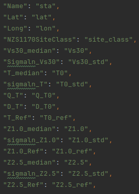
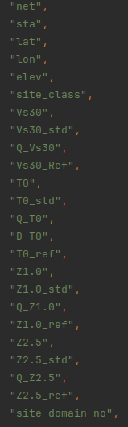

This page describes the process that occurs during the fetching site table step of the NZGMDB Pipeline.

# Prerequisites
- None

# Process
We utilize the FDSN Clients from obspy to fetch simple station information such as the network code, station code, lat, lon and elevation values. The "GEONET" client is used to obtain all of the stations in NZ and the "IRIS" client is used to fetch the single station SNZO.

This information is then paired with a file [Geonet  Metadata  Summary_v1.4.csv](https://github.com/ucgmsim/nzgmdb/blob/2fa80fa0917989c1103ed0a1e4821be7bb8f0e73/nzgmdb/data/Geonet%20%20Metadata%20%20Summary_v1.4.csv) found in the data folder of the NZGMDB github. This file contains site information as shown below in the screenshot.

These are merged and if the station is not in the Geonet Summary file then it will not appear in the site table.
Currently this does mean that there are sites used in the database that don't have lat and lon values as they are not in the Geonet Summary file.

The domain of each site is also added by utilizing the [TectonicDomains_Feb2021_8_NZTM.shp](https://github.com/ucgmsim/nzgmdb/blob/2fa80fa0917989c1103ed0a1e4821be7bb8f0e73/nzgmdb/data/tect_domain/TectonicDomains_Feb2021_8_NZTM.shp) file in the data directory which gets added as a field called "site_domain_no" which is the associated domain number if the site is located in the region.

# Output
"site_table_basin.csv" which contains the following columns in the screen shot shown

