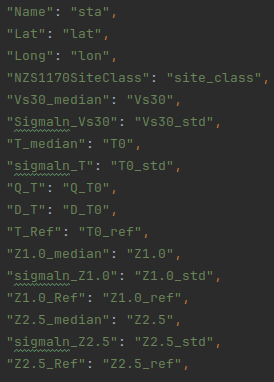
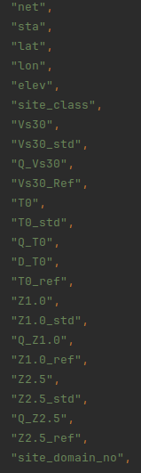

# 📍 Fetching Site Table

This step in the NZGMDB pipeline collects metadata for all seismic stations within New Zealand. It combines station information from GeoNet with local metadata and assigns each site to a basin if applicable.

---


## 🚀 Entry Point

To generate the site table, run the following Python script:

```bash
python -m nzgmdb.scripts.run_nzgmdb generate-site-table-basin <main_dir>
```

- **<main_dir>** is the top-level output directory where NZGMDB stores its results.

Example:
```bash
python -m nzgmdb.scripts.run_nzgmdb generate-site-table-basin nzgmdb_output/
```

This will create the file:

```bash
nzgmdb_output/flatfiles/site_table_basin.csv
```

## ⚙️ Process

### 🔹 Fetch Station Metadata
- Uses ObsPy’s `FDSN_Client` to download station metadata from the GeoNet network, including:
  - Network code
  - Station code
  - Latitude / Longitude
  - Elevation

### 🔹 Merge with Local Site Metadata
- The fetched station list is merged with a local Geonet metadata summary CSV, which includes geotechnical properties such as:
  - NZS1170 Site Class
  - Vs30 median and standard deviation
  - Basin depths (Z1.0, Z2.5)
  - Other site parameters like T0 and Q factors
- ⚠️ **Note:** This metadata is loaded from the NZGMDB data registry and **not** directly from the GitHub repository.
- Stations missing from the metadata summary may have missing fields after the merge.

### 🔹 Assign Tectonic Domain
- Each site is assigned a tectonic domain number by spatially intersecting the site coordinates with a tectonic domain shapefile:
  - `TectonicDomains_Feb2021_8_NZTM.shp` (and associated `.dbf`, `.shx` files)
- The output field `site_domain_no` represents the tectonic domain ID indicating the regional tectonic environment of the station.

---

## 🧩 Function: `create_site_table_response()`

Creates the complete site table by combining FDSN station data, geotechnical metadata, and tectonic domain assignments.

**Returns:**  
`pd.DataFrame` – The combined site table with station metadata, geotechnical site properties, and tectonic domain number.

---

## 🔹 Add Basin Information

### Function: `add_site_basins(site_df: pd.DataFrame)`

Adds basin information to the site table dataframe by checking if station coordinates fall inside known basin polygons.

- Loads the latest version of basin outlines from the velocity modelling registry.
- Uses a spatial point-in-polygon test to assign the basin name to sites located within basin boundaries.
- Adds a new column `basin` to the input dataframe.

**Parameters:**  
`site_df: pd.DataFrame` – The site table dataframe with columns at least including `lon` and `lat`.

**Returns:**  
`pd.DataFrame` – The input dataframe with an additional `basin` column.

---

## 📦 Output

- The final merged dataframe can be saved as `site_table_basin.csv` (or similar), containing:

| Column          | Description                                                   |
|-----------------|---------------------------------------------------------------|
| `net`           | Network code (e.g., "NZ")                                     |
| `sta`           | Station code identifier (e.g., "DCZ")                         |
| `lat`           | Latitude of station location (WGS84)                          |
| `lon`           | Longitude of station location (WGS84)                         |
| `elev`          | Station elevation in meters                                   |
| `site_class`    | NZS1170 site classification                                   |
| `Vs30`          | Shear wave velocity (Vs30) median value in m/s                |
| `Vs30_std`      | Standard deviation of Vs30                                    |
| `Q_Vs30`        | Quality flag for Vs30                                          |
| `Vs30_Ref`      | Reference for Vs30 data source                                |
| `T0`            | Median fundamental period (seconds)                          |
| `T0_std`        | Standard deviation of T0                                      |
| `Q_T0`          | Quality flag for T0                                           |
| `D_T0`          | Damping for T0                                               |
| `T0_ref`        | Reference for T0 data source                                  |
| `Z1.0`          | Basin depth to 1.0 km/s shear wave velocity (meters)         |
| `Z1.0_std`      | Standard deviation of Z1.0                                    |
| `Q_Z1.0`        | Quality flag for Z1.0                                         |
| `Z1.0_ref`      | Reference for Z1.0 data source                                |
| `Z2.5`          | Basin depth to 2.5 km/s shear wave velocity (meters, scaled) |
| `Z2.5_std`      | Standard deviation of Z2.5                                    |
| `Q_Z2.5`        | Quality flag for Z2.5                                         |
| `Z2.5_ref`      | Reference for Z2.5 data source                                |
| `site_domain_no`| Integer tectonic domain ID assigned from shapefile           |
| `basin`         | Basin name assigned based on spatial polygon test (optional) |

---

## 📚 Additional Notes

- The tectonic domain shapefiles and metadata CSV files are managed via the NZGMDB data registry, ensuring consistent data versioning.
- Basin assignment requires access to basin boundary polygon data managed in the velocity modelling registry.
- The Vs30 and basin depths (Z1.0, Z2.5) values are critical geotechnical parameters used in site characterization for seismic hazard assessments.


# Process
We utilize the FDSN Clients from obspy to fetch simple station information such as the network code, station code, lat, lon and elevation values. The "GEONET" client is used to obtain all of the stations in NZ.

This information is then paired with a file [Geonet  Metadata  Summary_v1.4.csv](https://github.com/ucgmsim/nzgmdb/blob/2fa80fa0917989c1103ed0a1e4821be7bb8f0e73/nzgmdb/data/Geonet%20%20Metadata%20%20Summary_v1.4.csv) found in the data folder of the NZGMDB github. This file contains site information as shown below in the screenshot.



These are merged and if the station is not in the Geonet Summary file then it will not appear in the site table.
Currently this does mean that there are sites used in the database that don't have lat and lon values as they are not in the Geonet Summary file.

The domain of each site is also added by utilizing the [TectonicDomains_Feb2021_8_NZTM.shp](https://github.com/ucgmsim/nzgmdb/blob/2fa80fa0917989c1103ed0a1e4821be7bb8f0e73/nzgmdb/data/tect_domain/TectonicDomains_Feb2021_8_NZTM.shp) file in the data directory which gets added as a field called "site_domain_no" which is the associated domain number if the site is located in the region.

# Output
"site_table_basin.csv" which contains the following columns in the screen shot shown


