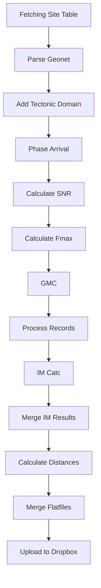
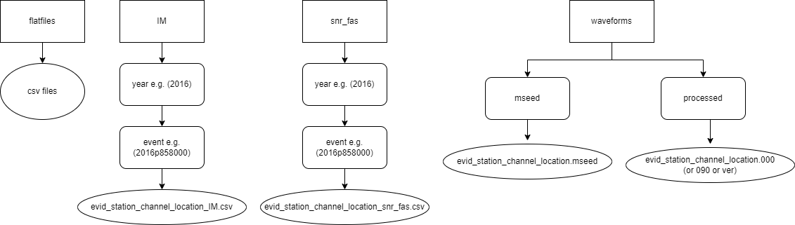

# Welcome to the NZGMDB WIKI

This wiki will explain all the processes and steps of the pipeline in detail from start to finish.

# Overview
The pipeline is split into many small subtasks which are described briefly below
1. **[Fetching Site Table](https://github.com/ucgmsim/nzgmdb/wiki/Fetching-site-table)** (Gets all the sites in the NZ network domain + SNZO and gathers data such as Vs30 and basin info)
2. **[Parse Geonet](https://github.com/ucgmsim/nzgmdb/wiki/Parse-Geonet)** (Gets all mseed files from Geonet and starts the earthquake source table)
3. **[Add Tectonic domain](https://github.com/ucgmsim/nzgmdb/wiki/Add-Tectonic-domain)** (Adds the tectonic type to the earthquake source table)
4. **[Phase Arrival](https://github.com/ucgmsim/nzgmdb/wiki/Phase-Arrival)** (Generates the P and S Wave arrival times for records using a custom P wave picker and the inclusion of Geonet pick data)
5. **[Calculate SNR](https://github.com/ucgmsim/nzgmdb/wiki/Calculate-SNR)** (Computes SNR and FAS Intensity Measure files)
6. **[Calculate Fmax](https://github.com/ucgmsim/nzgmdb/wiki/Calculate-Fmax)** (Computes Fmax from SNR data)
7. **[GMC](https://github.com/ucgmsim/nzgmdb/wiki/GMC)** (Machine Learning Model to classify records and produce Fmin)
8. **[Process records](https://github.com/ucgmsim/nzgmdb/wiki/Process-Records)** (Filters records based on GMC results and performs wave processing to turn mseeds into text files)
9. **[IM Calculation](https://github.com/ucgmsim/nzgmdb/wiki/IM-Calculation)** (Performs Intensity Measure Calculations such as pSA etc.)
10. **[Merge IM results](https://github.com/ucgmsim/nzgmdb/wiki/Merge-IM-Results)** (Merges all IM result files together and applies a Ds595 filter)
11. **[Calculate Distances](https://github.com/ucgmsim/nzgmdb/wiki/Calculate-Distances)** (Determines correct nodal plane to calculate rrup values for the propagation table)
12. **[Merge flatfiles](https://github.com/ucgmsim/nzgmdb/wiki/Merge-Flatfiles)** (Merges all flatfiles to ensure to remove filtered entries and split IM results per component into different flatfiles)
13. **[Upload to Dropbox](https://github.com/ucgmsim/nzgmdb/wiki/Upload-Dropbox)** (Zips together the files that are generated by the NZGMDB and uploads them to a dropbox folder)

The below flowchart shows visually the order of the pipeline steps which can be executed in order by calling one script.

# File Structure
The section below explains the file structure of the current NZGMDB after a successful run of the pipeline. This will also go over filename conventions.

## Top Level
The top level has 4 folders:
1. **flatfiles** (This contains all the csv data files for all records as well as skipped record information)
2. **IM** (Contains all the IM.csv files that are computed per record processed)
3. **snr_fas** (Contains all the snr_fas.csv files computed per record where there is a phase arrival)
4. **waveforms** (Holds all the mseed and text files for raw and processed records)

### Lower Levels
The **IM**, **snr_fas** and **waveforms** directories have a structure that is very similar underneath.
This is followed by a year folder such as "2022" and then an event folder which is the same as the evid such as "2022p002924".

After that it differs as **IM** stores IM.csv files in the event folder per record with the naming convention evid_station_channel_location_IM.csv for example "2022p002924_DCZ_HN_20_IM.csv".

**snr_fas** is similar in which the same naming convention is used except with the suffix snr_fas.csv for example "2022p002924_DCZ_HN_20_snr_fas.csv" and are placed in the event directory too.

For **waveforms** under the event directory you then get 2 folders, **mseed** and **processed** where **mseed** contains the raw record data for all 3 components in a obspy Stream format. Filenames in the **mseed** directory are the same as IM and snr_fas except the changed suffix for just the record id and the file extension being .mseed for example "2022p002924_DCZ_HN_20.mseed". Under **processed** for each record that passes processing will get 3 files for each component 000 090 and ver. These are now a replacement of the files extensions for example "2022p002924_DCZ_HN_20.000" 2022p002924_DCZ_HN_20.090" "2022p002924_DCZ_HN_20.ver" and are all text files containing waveform data

**flatfiles** contains a bunch of csv files that will be breifly explained below
1. **earthquake_source_table.csv** Holds all of the event source data for each event that has records in the final output for Intensity Measures that passed all processing.
2. **fmax.csv** Holds the max frequency data per record per component 000, 090, ver
3. **fmax_skipped_records.csv** Holds the records that were skipped during the fmax processing step of the pipeline
4. **gmc_predictions.csv** Holds the score values and min frequency values for each record and component
5. **ground_motion_im_catalogue.csv** Holds every Intensity Measure for every record and computed component 000, 090, ver, rotd50, rotd100
6. **ground_motion_im_table_000.csv** Holds just the Intensity Measure information per record for just component 000
7. **ground_motion_im_table_000_flat.csv** Holds the Intensity Measure information per record for just component 000 and includes a bunch of combined information such as site, fmin, fmax, score values and source info
7. **ground_motion_im_table_090.csv** Holds just the Intensity Measure information per record for just component 090
8. **ground_motion_im_table_090_flat.csv** Holds the Intensity Measure information per record for just component 090 and includes a bunch of combined information such as site, fmin, fmax, score values and source info
9. **ground_motion_im_table_ver.csv** Holds just the Intensity Measure information per record for just component ver
10. **ground_motion_im_table_ver_flat.csv** Holds the Intensity Measure information per record for just component ver and includes a bunch of combined information such as site, fmin, fmax, score values and source info
11. **ground_motion_im_table_rodt50.csv** Holds just the Intensity Measure information per record for just component rodt50
12. **ground_motion_im_table_rodt50_flat.csv** Holds the Intensity Measure information per record for just component rodt50 and includes a bunch of combined information such as site, fmin, fmax, score values and source info
13. **ground_motion_im_table_rodt100.csv** Holds just the Intensity Measure information per record for just component rodt100
14. **ground_motion_im_table_rodt100_flat.csv** Holds the Intensity Measure information per record for just component rodt100 and includes a bunch of combined information such as site, fmin, fmax, score values and source info
15. **IM_calc_skipped_records.csv** Holds the records that were skipped during the IM Calculation processing step of the pipeline
16. **IM_merge_skipped_records.csv** Holds the records that were skipped during the IM Merge processing step of the pipeline
17. **phase_arrival_table.csv** Holds the phase arrival info for P and S waves from the custom p-wave picker and Geonet when not found in the custom picker
18. **processing_skipped_records.csv** Holds the records that were skipped during the Processing step of the pipeline
19. **propagation_path_table.csv** Stores that rrup, rjb, rx, ry values for each station and event pair
20. **site_table_basin.csv** Stores all the site information such as vs30 and Z values and includes basin information
21. **snr_metadata.csv** Stores all metadata during the snr calculation such as Ds, Dn and npts and delta per record.
22. **snr_skipped_records.csv** Holds the records that were skipped during the SNR processing step of the pipeline
23. **station_magnitude_table.csv** Holds every station magnitude data per event and site pair
