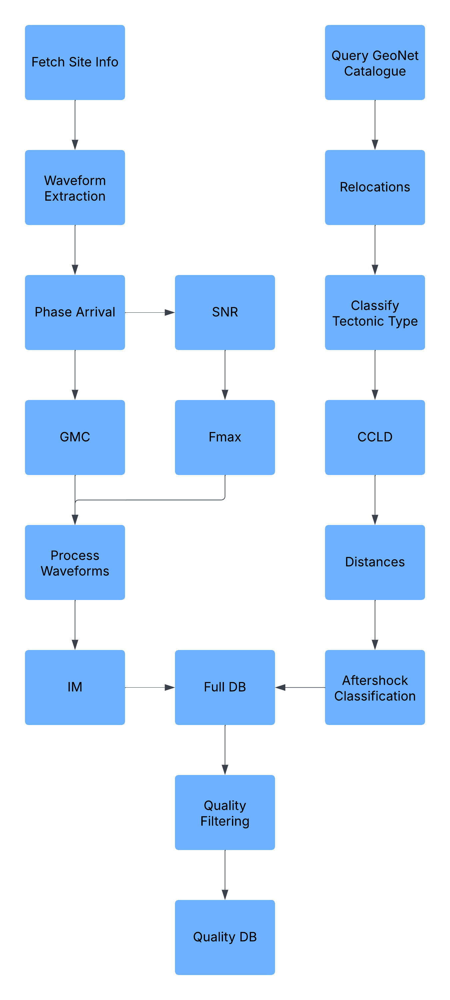

# Welcome to the NZGMDB WIKI

The present wikipage provides a detailed description of the pipeline used for the development of the New Zealand Ground Motion Database (NZGMDB), including its scientific background, the output file structure, and instructions for execution.

# 🌐 NZGMDB Pipeline Overview

The NZGMDB pipeline is split into two main concurrent tracks that handle:

- **Site data, waveform processing and Intensity Measure calculations**
- **Event metadata, aftershock and distance calculations**

Both tracks converge to integrate the data into the full database, followed by quality filtering.

Below is a breakdown of each stream and the merged steps.



---

## 🏠 Site Information Stream

### **Fetch Site Info**
Gathers all stations in the NZ network, including Vs30 and basin metadata.

### **Waveform Extraction**
Downloads miniSEED (mseed) raw waveforms from GeoNet using the FDSN Client.

### **Phase Arrival Detection**
Estimate P and S-wave arrival times using PhaseNet.

### **Signal-to-Noise Ratio (SNR)**
Calculates SNR from waveforms.

### **Fmax Calculation**
Determines max frequency (Fmax) from SNR data.

### **Ground Motion Classification (GMC)**
Classifies records (machine learning-based) to generate Fmin and quality metadata.

### **Process Waveforms**
Applies waveform processing (de-trend, de-mean, taper, etc.) and converts MSEED to ascii.

### **Intensity Measure (IM) Calculation**
Computes the intensity measures from the processed waveforms (PSA, PGV, PGA, FAS, CAV5, CAV, AI, Significant Durations, etc.)

---

## 💥 Event Metadata Stream

### **Query GeoNet Catalogue**
Pulls event metadata and origin times.

### **Relocations** *(internal step)*
Refines event locations based on relocation studies.

### **Classify Tectonic Type**
Adds tectonic classification for each event.

### **CCLD Calculation**
Infer fault planes using the CCLD method.

### **Compute Distances**
Compute hypocentral, epicentral, and source-to-site distances using the fault geometries.

### **Aftershock Classification**
Determines whether an event is an aftershock.

---

## 🔁 Merged Processing Stream

After both pipelines complete, the results are merged to perform the following:

### **Merge Full Database**
Combines all data into a unified database.

### **Quality Filtering**
Applies filtering rules to ensure only high-quality records are included.

### **Generate Final Quality DB**
Outputs a quality database flatfiles with all filtered records.

---

## ⚙️ Software Pipeline Execution
While the flowchart provides a conceptual overview of the NZGMDB pipeline's data dependencies, the actual software implementation is optimised for performance and diverges slightly from this sequential structure.

The pipeline is therefore composed of subtasks that can be run independently. These subtasks are listed below, along with links to their detailed documentation to explain what parts of the site and event streams the task invloves.

### 🧩 Subtasks
1. **[Fetching Site Table](https://github.com/ucgmsim/nzgmdb/wiki/Fetching-site-table)** (Gets all the sites in the NZ network domain and gathers their metadata, such as Vs30 and basin info)
2. **[Parse Geonet](https://github.com/ucgmsim/nzgmdb/wiki/Parse-Geonet)** (Gets all mseed files from Geonet and starts the earthquake source table)
3. **[Add Tectonic domain](https://github.com/ucgmsim/nzgmdb/wiki/Add-Tectonic-domain)** (Adds the tectonic classification to the earthquake source table and handles relocations)
4. **[Phase Arrival](https://github.com/ucgmsim/nzgmdb/wiki/Phase-Arrival)** (Estimates the P- and S-wave arrival times for records using PhaseNet)
5. **[Calculate SNR](https://github.com/ucgmsim/nzgmdb/wiki/Calculate-SNR)** (Computes SNR and FAS files)
6. **[Calculate Fmax](https://github.com/ucgmsim/nzgmdb/wiki/Calculate-Fmax)** (Computes Fmax from SNR data)
7. **[GMC](https://github.com/ucgmsim/nzgmdb/wiki/GMC)** (Machine Learning Model to classify records and produce Fmin and quality metadata)
8. **[Process records](https://github.com/ucgmsim/nzgmdb/wiki/Process-Records)** (Filters records based on GMC results and performs wave processing to turn mseeds into text files)
9. **[IM Calculation](https://github.com/ucgmsim/nzgmdb/wiki/IM-Calculation)** (Performs Intensity Measure Calculations)
10. **[Merge IM results](https://github.com/ucgmsim/nzgmdb/wiki/Merge-IM-Results)** (Merges all IM result files together)
11. **[Calculate Distances](https://github.com/ucgmsim/nzgmdb/wiki/Calculate-Distances)** (Determines fault planes to calculate distance values for the propagation table)
12. **[Merge Aftershocks](Merge-Aftershocks.md)** (Merges aftershock classification into the earthquake source table)
13. **[Merge flatfiles](https://github.com/ucgmsim/nzgmdb/wiki/Merge-Flatfiles)** (Merges all flatfiles to ensure to remove filtered entries and split IM results per component into different flatfiles)
14. **[Quality DB](Quality-DB.md)** (Applies filters and generates the final quality database flatfiles with all filtered records)

---

## 🗂️ File Structure

After a successful run of the NZGMDB pipeline, the output directory is organised into multiple top-level folders. Each contains files related to specific steps in the pipeline, following a consistent naming convention for ease of traceability and downstream analysis.

### 📁 Top-Level Directories

- **`flatfiles/`**  
  Contains merged CSV outputs for ground motion intensity measures (IMs), component-specific results, supporting metadata, and skipped record logs. These files summarise the final data products and intermediate results from each pipeline stage.

  - **`earthquake_source_table.csv`**  
    Contains source metadata for each event.

  - **`earthquake_source_geometry.csv`**  
    Contains the fault geometry for each event, including strike, dip, rake, and full corner coordinates.

  - **`fmax.csv`**  
    Contains maximum frequency values per record and component (000, 090, ver).

  - **`fmax_skipped_records.csv`**  
    Lists records skipped during the fmax calculation stage.

  - **`geonet_skipped_records.csv`**  
    Records that were skipped during the GeoNet data fetching stage.

  - **`gmc_predictions.csv`**  
    Contains machine learning classification results, including score and Fmin per record/component.

  - **`ground_motion_im_catalogue.csv`**  
    Full catalogue of all IMs per record for components: 000, 090, ver, rotd0, rotd50, rotd100, EAS.

  - **`ground_motion_im_table_000.csv`**  
    IMs for component 000 only, per record.

  - **`ground_motion_im_table_000_flat.csv`**  
    Component 000 IMs with combined metadata: site, fmin, fmax, scores, source info.

  - **`ground_motion_im_table_090.csv`**  
    IMs for component 090 only, per record.

  - **`ground_motion_im_table_090_flat.csv`**  
    Component 090 IMs with combined metadata: site, fmin, fmax, scores, source info.

  - **`ground_motion_im_table_ver.csv`**  
    IMs for vertical component (ver) only, per record.

  - **`ground_motion_im_table_ver_flat.csv`**  
    Vertical component IMs with combined metadata: site, fmin, fmax, scores, source info.

  - **`ground_motion_im_table_rotd0.csv`**
    IMs for computed component rotd0 only, per record.

  - **`ground_motion_im_table_rotd0_flat.csv`**  
    IMs for computed component rotd0 only, with combined metadata: site, fmin, fmax, scores, source info.

  - **`ground_motion_im_table_rotd50.csv`**  
    IMs for computed component rotd50 only.

  - **`ground_motion_im_table_rotd50_flat.csv`**  
    RotD50 IMs with combined metadata: site, fmin, fmax, scores, source info.

  - **`ground_motion_im_table_rotd100.csv`**  
    IMs for computed component rotd100 only.

  - **`ground_motion_im_table_rotd100_flat.csv`**  
    RotD100 IMs with combined metadata: site, fmin, fmax, scores, source info.

  - **`ground_motion_im_table_EAS.csv`**  
    IMs for computed component EAS (For FAS) only.

  - **`ground_motion_im_table_EAS_flat.csv`**
  EAS IMs with combined metadata: site, fmin, fmax, scores, source info.

  - **`IM_calc_skipped_records.csv`**  
    Records skipped during the Intensity Measure calculation stage.

  - **`missing_sites.csv`**  
    Sites with missing metadata (e.g., Vs30, basin info) that will be filtered out in the quality database.

  - **`phase_arrival_skipped_records.csv`**  
    Records skipped during the Phase Arrival detection stage.

  - **`phase_arrival_table.csv`**  
    Contains P and S-wave pick data from PhaseNet.

  - **`prob_series.h5`**  
    HDF5 file containing full probability series data from PhaseNet for each record.

  - **`processing_skipped_records.csv`**  
    Records skipped during the waveform processing stage.

  - **`propagation_path_table.csv`**  
    Contains distance metrics (e.g., rrup, rjb, rx, ry) for each station-event pair.

  - **`quality_skipped_records.csv`**  
    Records that were filtered out during the quality control stage and the reason as to why.

  - **`site_table.csv`**  
    Site metadata (e.g., Vs30, Z values) including if the site is within a basin.

  - **`snr_metadata.csv`**  
    Metadata from SNR computation: Ds, Dn, delta, npts per record.

  - **`snr_skipped_records.csv`**  
    Records skipped during SNR calculation and the reason why.

  - **`station_magnitude_table.csv`**  
    Station magnitude values for each station-event-channel pair.
  
  - **`clipped_records.csv`**  
    Records that were clipped by ClipNet during the fetch GeoNet data stage.

- **`quality_db/`**  
  Includes final cleaned, filtered flatfiles used as a deliverable database for ground motion analysis. This is a subset of the `flatfiles/` directory, containing only records that passed all quality checks. The files in this directory are ready for use in further research or engineering applications. The files that get included in this directory are:

    - **`earthquake_source_table.csv`**
    - **`earthquake_source_geometry.csv`**
    - **`fmax.csv`**
    - **`gmc_predictions.csv`**
    - **`ground_motion_im_table_000_flat.csv`**
    - **`ground_motion_im_table_090_flat.csv`**
    - **`ground_motion_im_table_ver_flat.csv`**
    - **`ground_motion_im_table_rotd0_flat.csv`**
    - **`ground_motion_im_table_rotd50_flat.csv`**
    - **`ground_motion_im_table_rotd100_flat.csv`**
    - **`ground_motion_im_table_EAS_flat.csv`**
    - **`phase_arrival_table.csv`**
    - **`propagation_path_table.csv`**
    - **`site_table.csv`**
    - **`snr_metadata.csv`**
    - **`station_magnitude_table.csv`**

- **`waveforms/`**  
  Includes both raw and processed waveform data for every event, organised by year and event ID. Under each `event_id/`, there are two subfolders mseed and processed. Below shows the structure of the `waveforms/` directory and naming conventions used for files:

```
waveforms/
└── <year>/                        # e.g. 2022
    └── <event_id>/                # e.g. 2022p002924
        ├── mseed/
        │   └── <event_id>_<station>_<channel>_<location>.mseed
        │       # e.g. 2022p002924_DCZ_HN_20.mseed
        │
        └── processed/
            ├── <event_id>_<station>_<channel>_<location>.000
            ├── <event_id>_<station>_<channel>_<location>.090
            └── <event_id>_<station>_<channel>_<location>.ver
                # e.g.
                # 2022p002924_DCZ_HN_20.000
                # 2022p002924_DCZ_HN_20.090
                # 2022p002924_DCZ_HN_20.ver
```

- **`IM/`**  
Stores per-record intensity measure (IM) CSV files computed during the IM Calculation stage. Files are organised by event ID, with each folder containing intensity measure results for every record that has corresponding processed waveform data. The structure of the IM/ directory and the naming convention is shown below:

```
IM/
└── <event_id>/                              # e.g. 2022p002924
    ├── <event_id>_<station>_<channel>_<location>_IM.csv
    │   # e.g. 2022p002924_DCZ_HN_20_IM.csv
    ├── ...
```

- **`snr_fas/`**  
    Contains signal-to-noise ratio (SNR) and Fourier Amplitude Spectrum (FAS) calculations for each record. Files are organised first by year, then by event ID. Each file includes SNR and FAS data for a single waveform record.

```
snr_fas/
└── <year>/                                  # e.g. 2022
    └── <event_id>/                          # e.g. 2022p002924
        ├── <event_id>_<station>_<channel>_<location>_snr_fas.csv
        │   # e.g. 2022p002924_DCZ_HN_20_snr_fas.csv
        ├── ...
```

- **`gmc/`**  
  Holds machine learning classification outputs, including Fmin values and quality scores for each waveform record. Files are grouped into batch folders (e.g., batch_0, batch_1, etc.) based on the number of parallel processes (n_procs) used during processing. Each batch folder contains the list of processed record IDs, extracted features, classification results, and corresponding logs.

```
gmc/
├── batch_0/
│   ├── batch_0.txt                    # List of record IDs used in this batch
│   ├── features_comp_X.csv            # Extracted features for X comp (Y and Z will be similar)
│   ├── gmc_predictions.csv            # Final predictions with Fmin and quality scores
│   ├── extract_features.log           # Log file for feature extraction
│   └── predict.log                    # Log file for predictions
│
├── batch_1/
│   ├── batch_1.txt
│   ├── features_comp_X.csv
│   ├── gmc_predictions.csv
│   ├── extract_features.log
│   └── predict.log
│
├── ...
```

- **`phase_arrival/`**  
  Contains P and S-wave arrival picks derived using PhaseNet. The data is organised into batch folders (e.g., batch_0, batch_1, etc.) based on the number of processes used during execution. Each batch includes input record tracking, pick results, probability series data, and logs.

```
phase_arrival/
├── batch_0/
│   ├── batch_0.txt                  # List of record IDs processed in this batch
│   ├── phase_arrival_table.csv      # Final P and S-wave picks with metadata
│   ├── prob_series.h5               # HDF5 file with full probability series from PhaseNet
│   ├── run_phasenet.log             # Log file from PhaseNet run
│   └── skipped_records.csv          # Records skipped and reasons why
│
├── batch_1/
│   ├── batch_1.txt
│   ├── phase_arrival_table.csv
│   ├── prob_series.h5
│   ├── run_phasenet.log
│   └── skipped_records.csv
│
├── ...
```