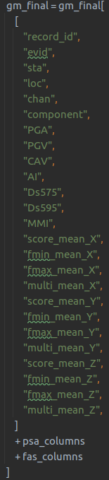

Merges all IM result files together and applies a Ds595 filter

# Prerequisites

Calculated IM files for each record

# Process

Merges all IM files together and applies a Ds595 filter

The Ds595 filter removes records that have a sum of less than 3 seconds of data across all 5 components computed.

This step also merges in the fmax data and the GMC predictions for each record.

# Output

The output is a csv file per record with all the IM data for each of the components called ground_motion_im_catalogue.csv
placed in the flatfile directory. Has the following columns.

