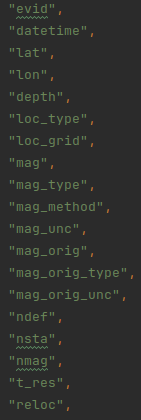
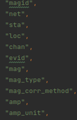

Fetches geonet data as mseed files for waveform data. Also produces the earthquake source table and station magnitude table.

# Prerequisites
- site_table_basin.csv in the flatfile directory

# Process
Given a date range the code now fetches directly from Geonet the earthquakes that have occurred during that timeframe with a min and max magnitude of 4 and 10, respectively.
The FDSN Client is then used to fetch more event data such as the datetime, lat, lon, depth etc. Uses the site_table_basin.csv to get the Vs30 values for the stations.

## Preferred Magnitude
The preferred magnitude is then determined by the following:
- Gets the default preferred magnitude from the client, if the type is "m" then fetches the max magnitude for "mb", "ml" and "mlv".
- If there is a magnitude for mb and less than 3 station counts then find max station count for ml and mlv and compare station counts to determine the loc_mag, otherwise make it mb
- If there is no mb then find max station count out of ml and mlv
- If there are none of mb, ml or mlv then try m

Otherwise if it isn't m for the prefer_mag_type then just set the magnitude uncertainty values to the preferred magnitude values.

Code can be found [here](https://github.com/ucgmsim/nzgmdb/blob/d020c6e32a76c156c1c58ded49ca7f4c76ee0f5d/nzgmdb/data_retrieval/geonet.py#L76)

## Fetching stations
When grabbing the station magnitude lines it gets the stations within a given radius
This is based on the Mw_rrups.txt file which cuts off at each end instead of extrapolation.
Then the inventory is selected using the max_radius from the event lat lon values.

Code can be found [here](https://github.com/ucgmsim/nzgmdb/blob/d020c6e32a76c156c1c58ded49ca7f4c76ee0f5d/nzgmdb/data_retrieval/geonet.py#L151)

## Fetching Waveforms
Grabbing the selection of the waveform data is semi complex due to figuring out the appropriate window for downloading and issues with the FDSN Client sometimes having incomplete reads and requires retires.

### Waveform Window
The window is determined from an estimated s-wave arrival time for the event using the TauPyModel iasp91.
This is then extended with a Ds value which is calculated from the openquake model Afshari and Stewart (2016), the input parameters for this currently include Vs30 from the site table when available (otherwise set to default of 500) a default rake value of 90 and magnitude value from the preferred magnitude and Z1.0 from the chiou_young_08 estimate from vs30.
The S-wave time and the Ds value are combined together with a ds_multiplier to get the end time of the record. (This also includes a minimum time difference to ensure the waveform is not cut too short).
The start time of the waveform window is determined from the P-wave arrival and the min time difference value before that.

### Getting Waveforms
Using the client the waveform is fetched using the start and end time windows with the filtered channel codes of HN and BN for strong motion stations only.
If there is no data for this window or for the given network station with channel codes then it will be skipped.
Another way the records can be skipped is if the file is too small then Obspy throws an error for the given network and station which is caught.
Another issue that occurs is an incomplete read, this can often be resolved by trying again. To implement this a max retries of 3 was added and if the incomplete read happens 3 times then it will skip the given station for that event.

Code can be found [here](https://github.com/ucgmsim/nzgmdb/blob/d020c6e32a76c156c1c58ded49ca7f4c76ee0f5d/nzgmdb/mseed_management/creation.py#L19)

## Filtering Waveforms
After the waveform is fetched and split into the different channels and locations for individual Streams of 3 components a filter is applied to them which is the gmprocess ClipNet. If the waveform has a higher clip value from the output of the ClipNet than the threshold value of 0.2 then the record is skipped.

## Saving Waveforms
If all of the following succeeds then the Stream object is saved in the format evid_station_channel_location.mseed in the waveforms directory.

## Station Magnitude Table
For every station magnitude line, the code will try to obtain the station magnitude from the Z channel where the first 2 channel codes match. If there is no such Z channel, it will try any channel that matches the first 2. If this also fails, the station magnitude is set to None and the type is set to the pref_mag_type.

Code can be found [here](https://github.com/ucgmsim/nzgmdb/blob/d020c6e32a76c156c1c58ded49ca7f4c76ee0f5d/nzgmdb/data_retrieval/geonet.py#L323)

# Output
Creates the earthquake source table with columns shown in the screenshot below.

Station Magnitude table with the following columns shown in the screen shot below.

