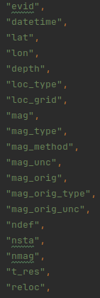
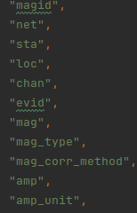

# 🌊 Parse GeoNet

This step in the NZGMDB pipeline fetches earthquake event data and seismic waveforms from GeoNet. It creates the earthquake source table, station magnitude table, and downloads MSEED files for subsequent processing.

---

## 🚀 Entry Point

To parse GeoNet data, run the following Python script:

```bash
python -m nzgmdb.scripts.run_nzgmdb parse-geonet <main_dir> <start_date> <end_date> [OPTIONS]
```

**Required Parameters:**
- **`<main_dir>`** - The top-level output directory where NZGMDB stores its results
- **`<start_date>`** - Start date for data extraction (YYYY-MM-DD format)
- **`<end_date>`** - End date for data extraction (YYYY-MM-DD format)

**Optional Parameters:**
- **`--n-procs`** - Number of processes to run (default: 1)
- **`--batch-size`** - Size of processing batches (default: 500)
- **`--only-event-ids`** - Comma-separated list of specific event IDs to process
- **`--only-sites`** - Comma-separated list of site names to filter
- **`--only-record-ids-ffp`** - Path to file containing specific record IDs to process
- **`--real-time`** - Use real-time mode with different client (default: False)
- **`--mp-sites`** - Use multiprocessing over sites instead of events (default: False)

**Example:**
```bash
python -m nzgmdb.scripts.run_nzgmdb parse-geonet nzgmdb_output/ 2020-01-01 2020-12-31 --n-procs 4 --batch-size 250
```

This will create several output files in the flatfiles directory:
- `earthquake_source_table.csv`
- `station_magnitude_table.csv`
- `geonet_skipped_records.csv`
- `geonet_clipped_records.csv`

---

## 📋 Prerequisites

- **`site_table_basin.csv`** must exist in the flatfiles directory (generated by the Fetching Site Table step)

---

## ⚙️ Process

### 🔹 Query GeoNet Earthquake Catalogue

The pipeline queries the GeoNet earthquake catalogue for events within the specified date range using magnitude constraints:
- **Minimum magnitude:** 4.0
- **Maximum magnitude:** 10.0

Event metadata is fetched using the FDSN Client, including:
- Event datetime and origin time
- Latitude, longitude, and depth
- Location method and earth model used
- Phase and station counts
- Standard error estimates

### 🔹 Determine Preferred Magnitude

The preferred magnitude selection follows a hierarchical approach:

1. **If preferred magnitude type is "m" (generic):**
   - Fetch maximum magnitudes for "mb", "ml", and "mlv" types
   - If mb magnitude exists with <3 station counts, compare with ml/mlv station counts
   - Otherwise, use mb as preferred magnitude
   - If no mb, select maximum station count between ml and mlv
   - Fall back to generic "m" if none available

2. **If preferred magnitude type is specific (not "m"):**
   - Use the preferred magnitude values directly
   - Set magnitude uncertainty from preferred magnitude errors

### 🔹 Station Selection Within Radius

For each earthquake, stations are selected within a distance-dependent radius:

- **Distance calculation:** Based on the `Mw_rrup.txt` lookup table
- **Interpolation:** Uses cubic interpolation between magnitude and distance values
- **Radius conversion:** Converts distance to degrees using ObsPy's geodetic functions
- **Station filtering:** Uses ObsPy inventory selection with latitude, longitude, and maximum radius

### 🔹 Waveform Window Calculation

The waveform download window is determined using seismic travel time models:

#### **Travel Time Estimation**
- **P-wave arrival:** Calculated using TauPy iasp91 model
- **S-wave arrival:** Calculated using TauPy iasp91 model

#### **Duration (Ds) Calculation**
- **Model:** Afshari and Stewart (2016) from OpenQuake
- **Parameters:**
  - Vs30 from site table (default: 500 m/s if unavailable)
  - Default rake value: 90°
  - Magnitude from preferred magnitude
  - Z1.0 estimated using Chiou-Young 2008 model from Vs30

#### **Window Definition**
- **Start time:** P-wave arrival minus minimum time buffer
- **End time:** S-wave arrival + Ds × multiplier + minimum duration
- **Minimum duration:** Ensures adequate waveform length

### 🔹 Waveform Data Retrieval

Waveforms are downloaded using the FDSN Client with specific constraints:

#### **Channel Selection**
- **Strong motion channels only:** HN and BN channel codes
- **Three-component data:** Horizontal (N-S, E-W) and vertical components

#### **Error Handling**
- **Incomplete reads:** Up to 3 retry attempts for network issues
- **Missing data:** Graceful skipping when no data available
- **File size errors:** Catches ObsPy errors for corrupted/small files
- **Network timeouts:** Robust retry mechanism for network failures

### 🔹 Waveform Quality Filtering

Downloaded waveforms undergo quality assessment:

#### **Clipping Detection**
- **Method:** gmprocess ClipNet algorithm
- **Threshold:** 0.2 clip value
- **Action:** Records exceeding threshold are flagged and skipped

#### **Component Splitting**
- **Processing:** Streams split into individual 3-component sets
- **Validation:** Ensures complete three-component data
- **Location codes:** Handles multiple location codes per station

### 🔹 Waveform File Management

Successfully processed waveforms are saved in standardized format:

#### **File Naming Convention**
```
{event_id}_{station}_{channel}_{location}.mseed
```

#### **Directory Structure**
- **Storage location:** `waveforms/` subdirectory
- **Organization:** Hierarchical by event and station
- **Format:** ObsPy Stream objects saved as MSEED files

### 🔹 Station Magnitude Processing

For each station-event pair, magnitude information is extracted:

#### **Magnitude Extraction Logic**
1. **Primary attempt:** Match Z-channel with first 2 channel codes
2. **Secondary attempt:** Use any channel matching first 2 codes
3. **Fallback:** Set magnitude to None, type to preferred magnitude type

#### **Amplitude Information**
- **Amplitude values:** Extracted from event amplitude objects
- **Units:** Preserved from original GeoNet data
- **Quality flags:** Maintained for downstream processing

---

## 📦 Output

The Parse GeoNet step generates several key output files:

### 🔹 Earthquake Source Table (`earthquake_source_table.csv`)

Contains comprehensive event metadata with the following columns:

| Column | Description |
|--------|-------------|
| `event_id` | Unique GeoNet event identifier |
| `datetime` | Event origin time (UTC) |
| `lat` | Event latitude (WGS84) |
| `lon` | Event longitude (WGS84) |
| `depth` | Event depth (km) |
| `loc_type` | Location method identifier |
| `loc_grid` | Earth model used for location |
| `pref_mag` | Preferred magnitude value |
| `pref_mag_type` | Preferred magnitude type (ML, Mb, etc.) |
| `pref_mag_method` | Magnitude calculation method |
| `pref_mag_unc` | Preferred magnitude uncertainty |
| `orig_mag` | Original preferred magnitude |
| `orig_mag_type` | Original magnitude type |
| `orig_mag_unc` | Original magnitude uncertainty |
| `ndef` | Number of defining phases |
| `nsta` | Number of stations used |
| `nmag` | Number of magnitude measurements |
| `std` | Location standard error |
| `reloc` | Relocation flag ("no" by default) |

### 🔹 Station Magnitude Table (`station_magnitude_table.csv`)

Records station-specific magnitude measurements:

| Column | Description |
|--------|-------------|
| `mag_id` | Unique magnitude identifier |
| `net` | Network code |
| `sta` | Station code |
| `loc` | Location code |
| `chan` | Channel code |
| `event_id` | Associated event identifier |
| `sta_mag` | Station magnitude value |
| `sta_mag_type` | Station magnitude type |
| `sta_mag_method` | Magnitude calculation method |
| `amp` | Amplitude measurement |
| `amp_unit` | Amplitude units |

### 🔹 Processing Logs

#### **Skipped Records (`geonet_skipped_records.csv`)**
- Records that couldn't be processed due to data availability or technical issues
- Includes record identifier and reason for skipping

#### **Clipped Records (`geonet_clipped_records.csv`)**
- Records flagged by ClipNet as having excessive clipping
- Contains record identifier and clipping metrics

### 🔹 MSEED Waveform Files

- **Location:** `waveforms/` directory
- **Format:** Standard MSEED format compatible with ObsPy
- **Naming:** `{event_id}_{station}_{channel}_{location}.mseed`
- **Content:** Three-component seismic waveforms ready for processing

---

## 🔧 Technical Implementation

### 🔹 Batch Processing

The pipeline implements efficient batch processing:
- **Batch creation:** Events split into configurable batch sizes
- **Progress tracking:** Processed batches tracked to enable resumption
- **Parallel execution:** Multiprocessing support for improved performance
- **Memory management:** Batch processing prevents memory overflow

### 🔹 Error Recovery

Robust error handling ensures pipeline resilience:
- **Network timeouts:** Automatic retry with exponential backoff
- **Partial failures:** Individual record failures don't stop batch processing
- **Incomplete data:** Graceful handling of missing or corrupted data
- **Resume capability:** Pipeline can resume from last successful batch

### 🔹 Performance Optimization

- **Multiprocessing:** Configurable process count for parallel execution
- **Caching:** Efficient reuse of client connections and inventory data
- **Batch sizing:** Optimized batch sizes balance memory usage and performance
- **Site filtering:** Optional site-specific processing for targeted runs

---

## ⚠️ Important Notes

- **Data dependencies:** Requires active internet connection to GeoNet FDSN services
- **Processing time:** Large date ranges may require significant processing time
- **Storage requirements:** MSEED files require substantial disk space
- **Network stability:** Poor network connections may cause increased retry attempts
- **Site table dependency:** Accurate Vs30 values depend on quality site table data


Fetches geonet data as mseed files for waveform data. Also produces the earthquake source table and station magnitude table.

# Prerequisites
- site_table_basin.csv in the flatfile directory

# Process
Given a date range the code now fetches directly from Geonet the earthquakes that have occurred during that timeframe with a min and max magnitude of 4 and 10, respectively.
The FDSN Client is then used to fetch more event data such as the datetime, lat, lon, depth etc. Uses the site_table_basin.csv to get the Vs30 values for the stations.

## Preferred Magnitude
The preferred magnitude is then determined by the following:
- Gets the default preferred magnitude from the client, if the type is "m" then fetches the max magnitude for "mb", "ml" and "mlv".
- If there is a magnitude for mb and less than 3 station counts then find max station count for ml and mlv and compare station counts to determine the loc_mag, otherwise make it mb
- If there is no mb then find max station count out of ml and mlv
- If there are none of mb, ml or mlv then try m

Otherwise if it isn't m for the prefer_mag_type then just set the magnitude uncertainty values to the preferred magnitude values.

Code can be found [here](https://github.com/ucgmsim/nzgmdb/blob/d020c6e32a76c156c1c58ded49ca7f4c76ee0f5d/nzgmdb/data_retrieval/geonet.py#L76)

## Fetching stations
When grabbing the station magnitude lines it gets the stations within a given radius
This is based on the Mw_rrups.txt file which cuts off at each end instead of extrapolation.
Then the inventory is selected using the max_radius from the event lat lon values.

Code can be found [here](https://github.com/ucgmsim/nzgmdb/blob/d020c6e32a76c156c1c58ded49ca7f4c76ee0f5d/nzgmdb/data_retrieval/geonet.py#L151)

## Fetching Waveforms
Grabbing the selection of the waveform data is semi complex due to figuring out the appropriate window for downloading and issues with the FDSN Client sometimes having incomplete reads and requires retires.

### Waveform Window
The window is determined from an estimated s-wave arrival time for the event using the TauPyModel iasp91.
This is then extended with a Ds value which is calculated from the openquake model Afshari and Stewart (2016), the input parameters for this currently include Vs30 from the site table when available (otherwise set to default of 500) a default rake value of 90 and magnitude value from the preferred magnitude and Z1.0 from the chiou_young_08 estimate from vs30.
The S-wave time and the Ds value are combined together with a ds_multiplier to get the end time of the record. (This also includes a minimum time difference to ensure the waveform is not cut too short).
The start time of the waveform window is determined from the P-wave arrival and the min time difference value before that.

### Getting Waveforms
Using the client the waveform is fetched using the start and end time windows with the filtered channel codes of HN and BN for strong motion stations only.
If there is no data for this window or for the given network station with channel codes then it will be skipped.
Another way the records can be skipped is if the file is too small then Obspy throws an error for the given network and station which is caught.
Another issue that occurs is an incomplete read, this can often be resolved by trying again. To implement this a max retries of 3 was added and if the incomplete read happens 3 times then it will skip the given station for that event.

Code can be found [here](https://github.com/ucgmsim/nzgmdb/blob/d020c6e32a76c156c1c58ded49ca7f4c76ee0f5d/nzgmdb/mseed_management/creation.py#L19)

## Filtering Waveforms
After the waveform is fetched and split into the different channels and locations for individual Streams of 3 components a filter is applied to them which is the gmprocess ClipNet. If the waveform has a higher clip value from the output of the ClipNet than the threshold value of 0.2 then the record is skipped.

## Saving Waveforms
If all of the following succeeds then the Stream object is saved in the format evid_station_channel_location.mseed in the waveforms directory.

## Station Magnitude Table
For every station magnitude line, the code will try to obtain the station magnitude from the Z channel where the first 2 channel codes match. If there is no such Z channel, it will try any channel that matches the first 2. If this also fails, the station magnitude is set to None and the type is set to the pref_mag_type.

Code can be found [here](https://github.com/ucgmsim/nzgmdb/blob/d020c6e32a76c156c1c58ded49ca7f4c76ee0f5d/nzgmdb/data_retrieval/geonet.py#L323)

# Output
Creates the earthquake source table with columns shown in the screenshot below.



Station Magnitude table with the following columns shown in the screen shot below.

