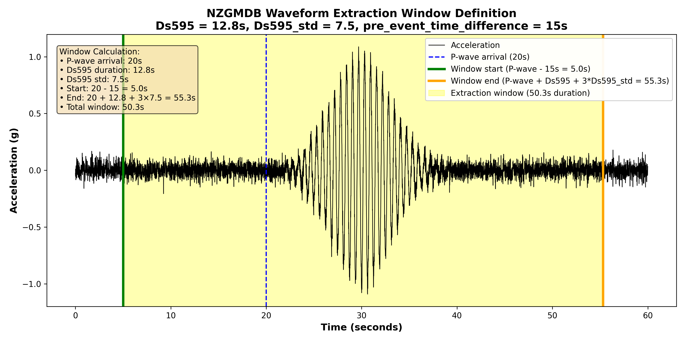

# 🔍 Parse GeoNet

This step in the NZGMDB pipeline combines earthquake catalogue querying and waveform extraction in a single efficient process. Rather than separately querying the catalogue and then downloading waveforms, this integrated approach fetches earthquake event data from GeoNet and immediately retrieves corresponding seismic waveforms for each event, creating the earthquake source table, station magnitude table, and downloading MSEED files for subsequent processing.

**Key Efficiency:** By processing catalogue data and waveform retrieval together this saves software processing time to get all of the results.

---

## 🚀 Entry Point

To parse GeoNet data, run the following Python script:

```bash
python -m nzgmdb.scripts.run_nzgmdb parse-geonet <main_dir> <start_date> <end_date> [OPTIONS]
```

**Required Parameters:**
- **`<main_dir>`** - The top-level output directory where NZGMDB stores its results
- **`<start_date>`** - Start date for data extraction (YYYY-MM-DD format)
- **`<end_date>`** - End date for data extraction (YYYY-MM-DD format)

**Optional Parameters:**
- **`--n-procs`** - Number of processes to run (default: 1)
- **`--batch-size`** - Size of processing batches (default: 500)
- **`--only-event-ids`** - Comma-separated list of specific event IDs to process
- **`--only-sites`** - Comma-separated list of site names to filter
- **`--only-record-ids-ffp`** - Path to file containing specific record IDs to process
- **`--real-time`** - Use real-time mode with different FDSN client (default: False)
- **`--mp-sites`** - Use multiprocessing over sites instead of events (default: False)

**Example:**
```bash
python -m nzgmdb.scripts.run_nzgmdb parse-geonet nzgmdb_output/ 2020-01-01 2020-12-31 --n-procs 4 --batch-size 250
```

This will create several output files in the flatfiles directory:
- `earthquake_source_table.csv`
- `station_magnitude_table.csv`
- `geonet_skipped_records.csv`
- `geonet_clipped_records.csv`

---

## 📋 Prerequisites

- **`site_table_basin.csv`** must exist in the flatfiles directory (generated by the Fetching Site Table step)

---

## ⚙️ Process

### 🔹 Query GeoNet Earthquake Catalogue

The pipeline queries the GeoNet earthquake catalogue for events within the specified date range using magnitude constraints from `config.yaml`:

**Configuration Parameters:**
- **Minimum magnitude:** `min_mag: 3.5`
- **Maximum magnitude:** `max_mag: 10`
- **Geographic bounds:** `bbox: [165.5205, -49.1817, -176.9238, -32.2871]` (New Zealand region)
- **GeoNet URL:** `geonet_url: https://quakesearch.geonet.org.nz`
- **Real-time URL:** `real_time_url: https://service-nrt.geonet.org.nz`

Event metadata is fetched using the FDSN Client, including:
- Event datetime and origin time
- Latitude, longitude, and depth
- Location method and earth model used
- Phase and station counts
- Standard error estimates

### 🔹 Determine Preferred Magnitude

The preferred magnitude selection follows a hierarchical approach:

1. **If preferred magnitude type is "m":**
   - Fetch maximum magnitudes for "mb", "ml", and "mlv" types
   - If mb magnitude exists with <3 station counts, compare with ml/mlv station counts
   - Otherwise, use mb as preferred magnitude
   - If no mb, select maximum station count between ml and mlv
   - Fall back to generic "m" if none available

2. **If preferred magnitude type is specific (not "m"):**
   - Use the preferred magnitude values directly
   - Set magnitude uncertainty from preferred magnitude errors

### 🔹 Station Selection Within Radius

For each earthquake, stations are selected within a distance-dependant radius:

- **Distance calculation:** Based on the `Mw_rrup.txt` lookup table

- **Interpolation:** Uses cubic interpolation between magnitude and distance values
- **Radius conversion:** Converts distance to degrees using ObsPy's geodetic functions
- **Station filtering:** Uses ObsPy inventory selection with latitude, longitude, and maximum radius
- **Channel filtering:** Restricted to strong motion channels (`channel_codes: [HN?, BN?]`)

### 🔹 Waveform Window Calculation

The waveform download window is determined using seismic travel time models and configuration parameters:

#### **Travel Time Estimation**
- **P-wave arrival:** Calculated using TauPy iasp91 model
- **S-wave arrival:** Calculated using TauPy iasp91 model

#### **Duration (Ds) Calculation**
- **Model:** Afshari and Stewart (2016) from OpenQuake
- **Parameters:**
  - Vs30 from site table (default: `vs30: 500` m/s if unavailable)
  - Default rake value: 90°
  - Magnitude from preferred magnitude
  - Z1.0 estimated using Chiou-Young 2008 model from Vs30

#### **Window Definition**
- **Start time:** P-wave arrival minus `min_time_difference: 15` seconds
- **End time:** S-wave arrival + Ds × `ds_multiplier: 2`, also ensures a minimum duration
- **Minimum duration:** Controlled by `min_time_difference` to ensure adequate waveform length

Example with a synthetic waveform to illustrate the window:


### 🔹 Waveform Data Retrieval

Waveforms are downloaded using the FDSN Client with specific constraints:

#### **Channel Selection**
- **Strong motion channels only:** `channel_codes: [HN?, BN?]` from configuration
- **Three-component data:** Horizontal (N-S, E-W) and vertical components

#### **Error Handling**
- **Incomplete reads:** Up to 3 retry attempts for network issues
- **Missing data:** Graceful skipping when no data available
- **File size errors:** Catches ObsPy errors for corrupted/small files that can't be processed
- **Network timeouts:** Robust retry mechanism for network failures

### 🔹 Waveform Quality Filtering

Downloaded waveforms undergo quality assessment using ClipNet with configuration thresholds:

#### **Clipping Detection**
- **Method:** gmprocess ClipNet algorithm
- **Threshold:** `clip_threshold: 0.2` from config.yaml
- **Action:** Records exceeding threshold are flagged and skipped
- **Magnitude bounds:** `mag_clip_low: 3.0`, `mag_clip_high: 8.8`
- **Distance bounds:** `dist_clip_low: 0.0`, `dist_clip_high: 645.0`

The output of this is saved to a `geonet_clipped_records.csv` file to be used during the quality_db step.

#### **Component Splitting**

Some Stream objects require extra splitting for a single evid_station combinations as there can be many different "locations" or "channels" for the same record.

- **Processing:** Streams split into individual 3-component sets
- **Validation:** Ensures complete three-component data
- **Location codes:** Handles multiple location codes per station

### 🔹 Waveform File Management

Successfully processed waveforms are saved in standardised format:

#### **File Naming Convention**
```
{event_id}_{station}_{channel}_{location}.mseed
```

#### **Directory Structure**
- **Storage location:** `waveforms/` subdirectory
- **Organisation:** Hierarchical by year then event ID then mseed directory
- **Format:** ObsPy Stream objects saved as MSEED files

### 🔹 Station Magnitude Processing

For each station-event pair, magnitude information is extracted:

#### **Magnitude Extraction Logic**
1. **Primary attempt:** Match Z-channel with first 2 channel codes
2. **Secondary attempt:** Use any channel matching first 2 codes
3. **Fallback:** Set magnitude to None, type to preferred magnitude type

#### **Amplitude Information**
- **Amplitude values:** Extracted from event amplitude objects
- **Units:** Preserved from original GeoNet data
- **Quality flags:** Maintained for downstream processing

---

## 📦 Output

The Parse GeoNet step generates several key output files:

### 🔹 Earthquake Source Table (`earthquake_source_table.csv`)

Contains comprehensive event metadata with the following columns:

| Column | Description |
|--------|-------------|
| `event_id` | Unique GeoNet event identifier |
| `datetime` | Event origin time (UTC) |
| `lat` | Event latitude (WGS84) |
| `lon` | Event longitude (WGS84) |
| `depth` | Event depth (km) |
| `loc_type` | Location method identifier |
| `loc_grid` | Earth model used for location |
| `pref_mag` | Preferred magnitude value |
| `pref_mag_type` | Preferred magnitude type (ML, Mb, etc.) |
| `pref_mag_method` | Magnitude calculation method |
| `pref_mag_unc` | Preferred magnitude uncertainty |
| `orig_mag` | Original preferred magnitude |
| `orig_mag_type` | Original magnitude type |
| `orig_mag_unc` | Original magnitude uncertainty |
| `ndef` | Number of defining phases |
| `nsta` | Number of stations used |
| `nmag` | Number of magnitude measurements |
| `std` | Location standard error |
| `reloc` | Relocation flag ("no" by default) |

### 🔹 Station Magnitude Table (`station_magnitude_table.csv`)

Records station-specific magnitude measurements:

| Column | Description |
|--------|-------------|
| `mag_id` | Unique magnitude identifier |
| `net` | Network code |
| `sta` | Station code |
| `loc` | Location code |
| `chan` | Channel code |
| `event_id` | Associated event identifier |
| `sta_mag` | Station magnitude value |
| `sta_mag_type` | Station magnitude type |
| `sta_mag_method` | Magnitude calculation method |
| `amp` | Amplitude measurement |
| `amp_unit` | Amplitude units |

### 🔹 Processing Logs

#### **Skipped Records (`geonet_skipped_records.csv`)**
- Records that couldn't be processed due to data availability or technical issues
- Includes record identifier and reason for skipping

#### **Clipped Records (`geonet_clipped_records.csv`)**
- Records flagged by ClipNet as having excessive clipping (above `clip_threshold: 0.2`)
- Contains record identifier and clipping metrics

### 🔹 MSEED Waveform Files

- **Location:** `waveforms/` directory
- **Format:** Standard MSEED format compatible with ObsPy
- **Naming:** `{event_id}_{station}_{channel}_{location}.mseed`
- **Content:** Three-component seismic waveforms ready for processing

---

## 🔧 Technical Implementation

### 🔹 Batch Processing

The pipeline implements efficient batch processing:
- **Batch creation:** Events split into configurable batch sizes
- **Progress tracking:** Processed batches tracked to enable checkpointing
- **Parallel execution:** Multiprocessing support for improved performance (can be adjusted to multiprocess over events and sites depending on the user's needs)

### 🔹 Error Recovery

Robust error handling ensures pipeline resilience:
- **Network timeouts:** Automatic retry
- **Partial failures:** Individual record failures don't stop batch processing
- **Incomplete data:** Graceful handling of missing or corrupted data
- **Resume capability:** Pipeline can resume from last successful batch

---

## ⚠️ Important Notes

- **Processing time:** Large date ranges (years) may require significant processing time (~6hours)
- **Network stability:** Poor network connections may cause increased retry attempts

---

## 🔗 Related Steps

- **Previous**: [Fetching-Site-Table](Fetching-site-table.md) - Fetches and processes site metadata from GeoNet
- **Next**: [Add Tectonic Domain](Add-Tectonic-Domain.md) - Assigns tectonic domain numbers to sites based on spatial intersection as well as tectonic type classification and relocations for some earthquakes