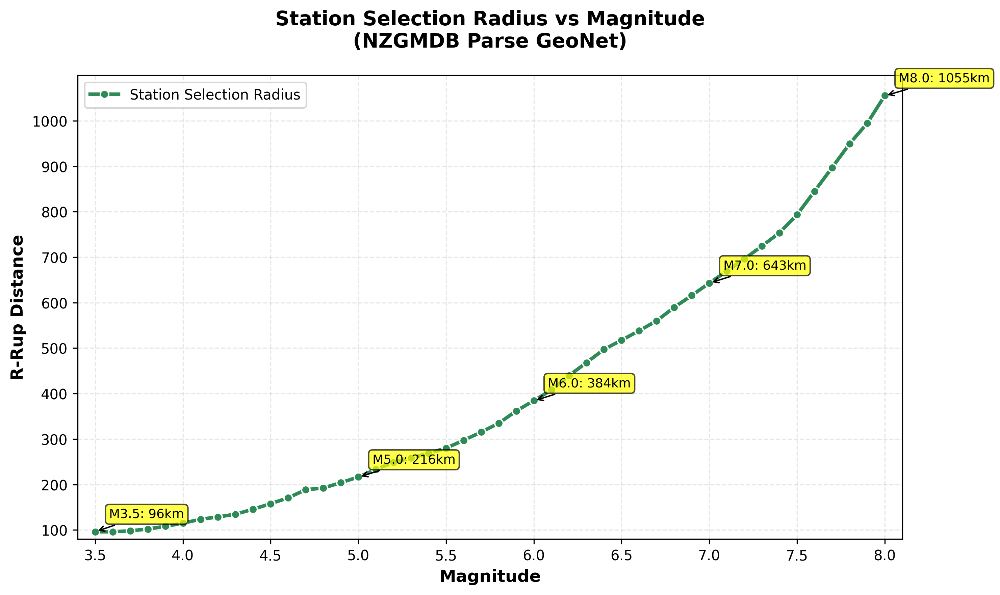

# 🔍 Parse GeoNet

This step in the NZGMDB pipeline queries the GeoNet earthquake catalogue to extract earthquake metadata and create the earthquake source table.
Also provided as an output because of this step is the station extraction table which contains the information used to create the start and end time selections for the waveforms.


---

## 🚀 Entry Point

To parse GeoNet data, run the following Python script:

```bash
python -m nzgmdb.scripts.run_nzgmdb parse-geonet <main_dir> <start_date> <end_date> [OPTIONS]
```

**Required Parameters:**
- **`<main_dir>`** - The top-level output directory where NZGMDB stores its results
- **`<start_date>`** - Start date for data extraction (YYYY-MM-DD format)
- **`<end_date>`** - End date for data extraction (YYYY-MM-DD format)

**Optional Parameters:**
- **`--n-procs`** - Number of processes to run (default: 1)
- **`--batch-size`** - Size of processing batches (default: 500)
- **`--only-event-ids`** - Comma-separated list of specific event IDs to process
- **`--only-sites`** - Comma-separated list of site names to filter
- **`--only-record-ids-ffp`** - Path to file containing specific record IDs to process
- **`--real-time`** - Use real-time mode with different FDSN client (default: False)
- **`--mp-sites`** - Use multiprocessing over sites instead of events (default: False)

**Example:**
```bash
python -m nzgmdb.scripts.run_nzgmdb parse-geonet nzgmdb_output/ 2020-01-01 2020-12-31 --n-procs 4 --batch-size 250
```

This will create several output files in the flatfiles directory:
- `earthquake_source_table.csv`
- `station_extraction_table.csv`
- `geonet_skipped_records.csv`

---

## 📋 Prerequisites

- **`site_table_basin.csv`** must exist in the flatfiles directory (generated by the Fetching Site Table step)

---

## ⚙️ Process

### 🔹 Query GeoNet Earthquake Catalogue

The pipeline queries the GeoNet earthquake catalogue for events within the specified date range using magnitude constraints from `config.yaml`:

**Configuration Parameters:**
- **Minimum magnitude:** `min_mag: 3.5`
- **Maximum magnitude:** `max_mag: 10`
- **Geographic bounds:** `bbox: [165.5205, -49.1817, -176.9238, -32.2871]` (New Zealand region)
- **GeoNet URL:** `geonet_url: https://quakesearch.geonet.org.nz`
- **Real-time URL:** `real_time_url: https://service-nrt.geonet.org.nz`

Event metadata is fetched using the FDSN Client, including:
- Event datetime and origin time
- Latitude, longitude, and depth
- Location method and earth model used
- Phase and station counts
- Standard error estimates

### 🔹 Determine Preferred Magnitude

The preferred magnitude selection follows a hierarchical approach:

1. **If preferred magnitude type is "m":**
   - Fetch maximum magnitudes for "mb", "ml", and "mlv" types
   - If mb magnitude exists with <3 station counts, compare with ml/mlv station counts
   - Otherwise, use mb as preferred magnitude
   - If no mb, select maximum station count between ml and mlv
   - Fall back to generic "m" if none available

2. **If preferred magnitude type is specific (not "m"):**
   - Use the preferred magnitude values directly
   - Set magnitude uncertainty from preferred magnitude errors

### 🔹 Station Selection Within Radius

For each earthquake, stations are selected within a distance-dependant radius:

- **Distance calculation:** Based on the `Mw_rrup.txt` lookup table

- **Interpolation:** Uses cubic interpolation between magnitude and distance values
- **Radius conversion:** Converts distance to degrees using ObsPy's geodetic functions
- **Station filtering:** Uses ObsPy inventory selection with latitude, longitude, and maximum radius
- **Channel filtering:** Restricted to strong motion channels (`channel_codes: [HN?, BN?]`)

### 🔹 Create Station Extraction Table

The station extraction table is generated with the following steps for every station-event pair within the defined radius:

First we need to obtain the Ds595 mean and std from the Afshari and Stewart (2016) model.

#### **Duration (Ds) Calculation**
- **Model:** Afshari and Stewart (2016) from OpenQuake
- **Parameters:**
  - Vs30 from site table (default: `vs30: 500` m/s if unavailable)
  - Default rake value: 90°
  - Magnitude from preferred magnitude
  - Z1.0 from site table (default: estimated using Chiou-Young 2008 model from Vs30 if unavailable)
  - r_hyp (hypocentral distance)

#### **Phase Arrival Time Estimation**
Then we estimate the P-wave arrival time at each station using the TauPyModel `iasp91` with certain phases:
- **phase_list**: ['P', 'p', 'Pn', 'Pg', 'Pb'] (Obtained from config.yaml)

This order is strictly followed when estimating the arrival time, meaning that if the first phase is not available, it will try the second phase and so on.
If none of the phases are available, the station-event pair is skipped and recorded in the `geonet_skipped_records.csv` file.


---

## 📦 Output

The Parse GeoNet step generates several key output files:

### 🔹 Earthquake Source Table (`earthquake_source_table.csv`)

Contains event metadata with the following columns:

| Column | Description |
|--------|-------------|
| `event_id` | Unique GeoNet event identifier |
| `datetime` | Event origin time (UTC) |
| `lat` | Event latitude (WGS84) |
| `lon` | Event longitude (WGS84) |
| `depth` | Event depth (km) |
| `loc_type` | Location method identifier |
| `loc_grid` | Earth model used for location |
| `pref_mag` | Preferred magnitude value |
| `pref_mag_type` | Preferred magnitude type (ML, Mb, etc.) |
| `pref_mag_method` | Magnitude calculation method |
| `pref_mag_unc` | Preferred magnitude uncertainty |
| `orig_mag` | Original preferred magnitude |
| `orig_mag_type` | Original magnitude type |
| `orig_mag_unc` | Original magnitude uncertainty |
| `ndef` | Number of defining phases |
| `nsta` | Number of stations used |
| `nmag` | Number of magnitude measurements |
| `std` | Location standard error |
| `reloc` | Relocation flag ("no" by default) |

### 🔹 Station Extraction Table (`station_extraction_table.csv`)

Contains station-event pair metadata with the following columns:

| Column | Description                                    |
|--------|------------------------------------------------|
| `net` | Network                                        |
| `sta` | Station                                        |
| `evid` | Unique GeoNet event identifier                 |
| `mag` | Preferred magnitude                            |
| `mag_type` | Preferred magnitude type (ML, Mb, etc.)        |
| `r_hyp` | Hypocentral distance (km)                      |
| `vs30` | Vs30 value from site table                     |
| `z1p0` | Z1.0 value from site table                     |
| `ds_mean` | Ds595 estimate from Afshari and Stewart (2016) |
| `ds_std` | Standard deviation of Ds595                    |
| `phase` | Phase used in estimated arrival time           |
| `ptime_est` | Estimated P-wave arrival time                  |

### 🔹 Processing Logs

#### **Skipped Records (`geonet_skipped_records.csv`)**
- Records that could not obtain a phase arrival estimate
- Contains event ID, station, and reason for skipping

---

## 🔧 Technical Implementation

### 🔹 Batch Processing

The pipeline implements efficient batch processing:
- **Batch creation:** Events split into configurable batch sizes
- **Progress tracking:** Processed batches tracked to enable checkpointing
- **Parallel execution:** Multiprocessing support for improved performance (can be adjusted to multiprocess over events and sites depending on the user's needs)

### 🔹 Error Recovery

Robust error handling ensures pipeline resilience:
- **Network timeouts:** Automatic retry
- **Partial failures:** Individual record failures don't stop batch processing
- **Incomplete data:** Graceful handling of missing or corrupted data
- **Resume capability:** Pipeline can resume from last successful batch

---

## ⚠️ Important Notes

- **Processing time:** Large date ranges (years) may require significant processing time (~6hours)
- **Network stability:** Poor network connections may cause increased retry attempts

---

## 🔗 Related Steps

- **Previous**: [Fetching-Site-Table](Fetching-site-table.md) - Fetches and processes site metadata from GeoNet
- **Next**: [Waveform-Extraction](Waveform-Extraction.md) - Extracts waveform data from the FDSN for selected events and stations
- **Related**: [Add Tectonic Domain](Add-Tectonic-Domain.md) - Assigns tectonic domain numbers to sites based on spatial intersection as well as tectonic type classification and relocations for some earthquakes