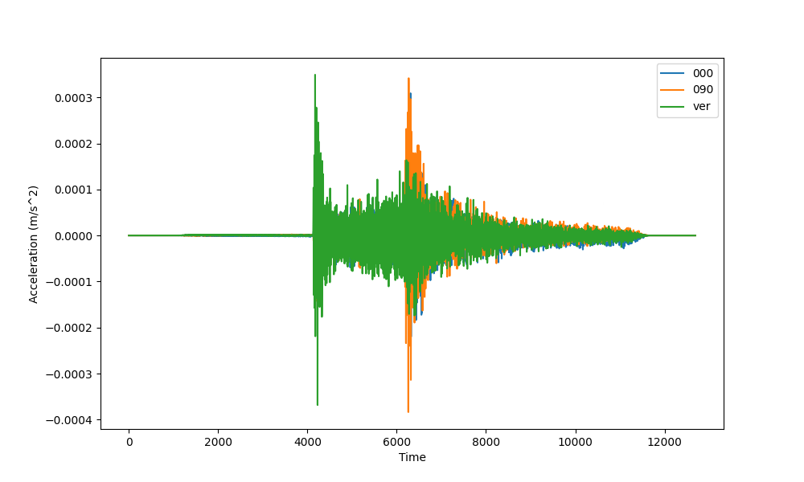
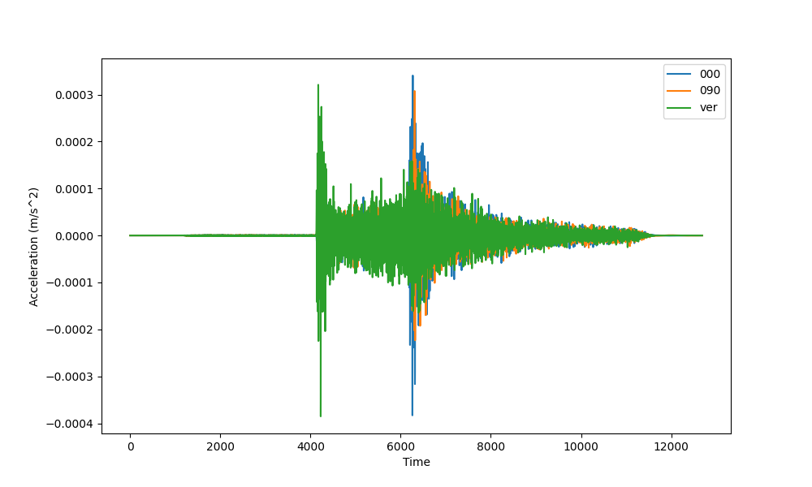

Filters records based on GMC results and performs wave processing to turn mseeds into text files

# Prerequisites
- GMC
- Parse Geonet (mseed files from FDSN Client)

# Process

The following is done for every mseed file in the waveforms / mseed folder:

A quick check is done that there are all 3 components (this was a previous bug that should be fixed, will observe)

Initial pre_processing (Same as what is written in Calculate-SNR) is then performed and processing is skipped if the Inventory failed to fetch or failed to remove sensitivity

fmax and fmin values are then extracted from the gmc and fmax dataframes
For fmin the max fmin_mean value is taken (max across all 3 components)
fmax is the min of all 3 components

If these values are not found then for the fmin, lowcut is set to 0.05 and if fmax is missing then the highcut is set to 1 / (2.5 * dt)
If these values are not found then the fmin lowcut is set to 0.05. Similarly, if fmax is missing then the highcut is set to 1 / (2.5 * dt)

Then the 000, 090 and ver components are selected from the initial processed mseed (rotated)
Tries to grab NE if not then tries XY and if not then skips record

Then applies the following for processing:
(Performs the Acc(t) for the public pathway)

Example of some of the processing

    butter bandpass filter - order of 4 fs = 1 / dt

    Remove zero padding

    Calculate velocity 

    vel_000 = integrate.cumtrapz(y=acc_bb_000, dx=dt, initial=0.0) * g / 10.0

    Calculate displacement 

    disp_000 = integrate.cumtrapz(y=vel_000, dx=dt, initial=0.0)

    Fit a six-order polynomial 

    coeff_000 = np.polyfit(np.arange(len(disp_000)), disp_000, poly_order)

    Find the 2nd derivative of the coefficients 

    coeff_000_2nd = np.polyder(coeff_000, 2)

    generate polynomial from the coefficients

    poly_000 = np.polyval(coeff_000_2nd, np.arange(len(acc_bb_000)))

    Subtract the polynomial from the original acc series

Example of raw mseed data vs the output of the processing

Raw Mseed:

Processed Waveform:

Code can be found [here](https://github.com/ucgmsim/nzgmdb/blob/d020c6e32a76c156c1c58ded49ca7f4c76ee0f5d/nzgmdb/data_processing/process_observed.py#L13)

# Output
If all checks are successfully passed, saves as individual component files named the same as the mseed but with the extensions of .000 .090 and .ver in the waveforms directory but under "processed".