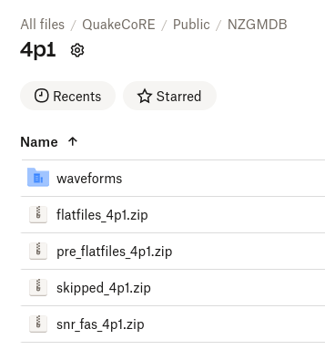

Zips together the files that are generated by the NZGMDB and uploads them to a dropbox folder.

# Prerequisites
- Merge Flatfiles
- Rclone

## Rclone
To ensure that this script works you need to make sure you have rclone setup on the machine that is running the script.

To do this ensure you have rclone installed https://rclone.org/install/

Then you need the rclone.conf file in this format placed at .config/rclone/rclone.conf on the machine. 
```shell
[dropbox]
type = dropbox
client_id =
client_secret =
token = {"access_token":"XXXXXXXXXXXXXXX","token_type":"bearer","expiry":"0001-01-01T00:00:00Z"}
```
Where the access_token is the token that you get from the dropbox API.
If you need access to the dropbox folder please contact the UCGMSIM team.

# Process
Seperates the different flatfiles that are in the file_structure.py and creates a zip folder for the:
- Final Flatfiles
- Pre Flatfiles
- Skipped Files

Also zips together the snr_fas files as well as the waveform files (raw and processed).
As part of the waveform upload the files get zipped based on year and then also for each year a new folder for each event_id in that year.
This allows people to download just 1 event if they want to.

After each of the zips are created they are uploaded to the dropbox folder which is specified as "dropbox:/QuakeCoRE/Public/NZGMDB" and then the version number subfolder which is determined by the argument for upload_to_dropbox or by default the main directory name.
When they get uploaded the files are also checked for the same file size as the local file to ensure nothing went wrong during the upload.
If something went wrong they get added to a list of files that failed to upload and then at the end of the script it will tell you where that file is located.

To re-submit the files that failed to upload you can run the script with the typer function upload_failed_files to try again with oly the files listed in the failed_files.txt.

# Output
Successfull uploaded files to dropbox that looks similar to the following image
