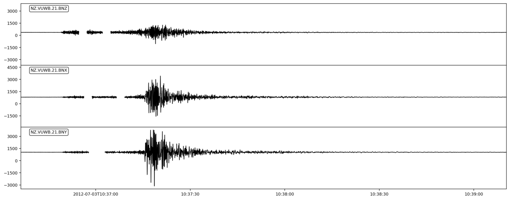
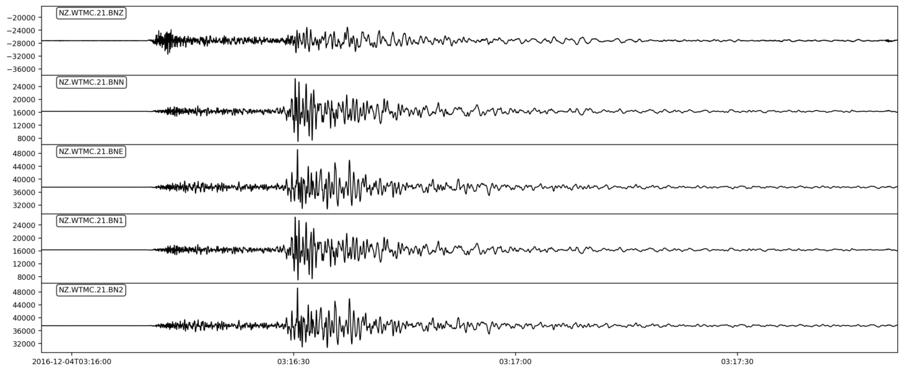
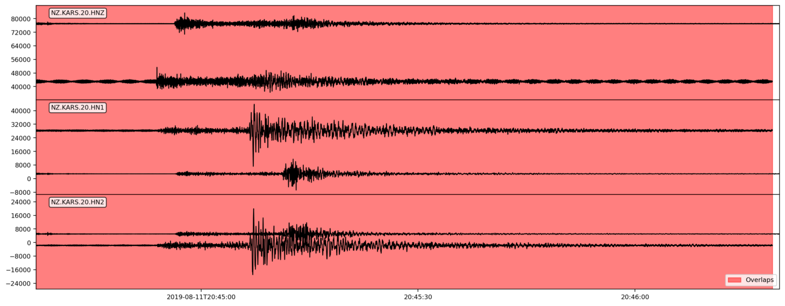
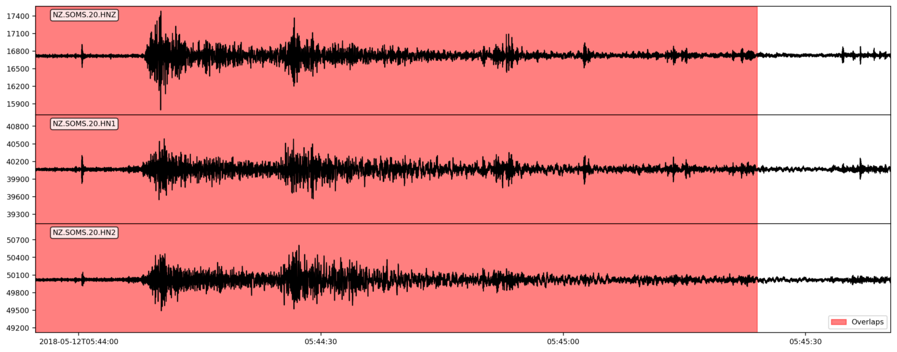
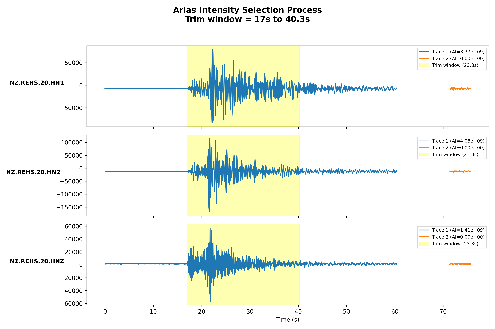

# ∿ Waveform Extraction

This step in the NZGMDB pipeline downloads waveform data for each station and event listed in the station extraction table. It manages missing data issues, and outputs the results in a structured format for further analysis in MSEED files.

---

## 🚀 Entry Point

To extract waveforms, run the following Python script:

```bash
python -m nzgmdb.scripts.run_nzgmdb extract-waveforms <main_dir> <station_extraction_table_ffp> [OPTIONS]
```

**Required Parameters:**
- **`<main_dir>`** \- The top-level output directory where NZGMDB stores its results
- **`<station_extraction_table_ffp>`** \- Path to the station extraction table CSV file

**Optional Parameters:**
- **`--n-procs`** \- Number of processes to run (default: 1)
- **`--batch-size`** \- Size of processing batches (default: 1000)
- **`--only-record-ids-ffp`** \- Path to file containing specific record IDs to process

**Example:**
```bash
python -m nzgmdb.scripts.run_nzgmdb extract-waveforms nzgmdb_output/ flatfiles/station_extraction_table.csv --n-procs 4 --batch-size 500
```

This will create several output files in the flatfiles directory:
- `station_magnitude_table_extraction.csv`
- `extraction_skipped_records.csv`
- `extraction_clipped_records.csv`
- `multi_trace_issue_records.csv`

---

## 📋 Prerequisites

- **`station_extraction_table_geonet.csv`** must exist in the flatfiles directory (generated by the Parse Geonet step)

---

## ⚙️ Process

For every row in the station extraction table, the following steps are performed:

### 🔹 Waveform Window Calculation

The waveform download window is determined by a event-site pairing using seismic travel time models and configuration parameters.
The travel times are already pre-calculated in the station extraction table, as well as the duration to determine the end of the window.

#### **Start time of waveform window**
We take the ptime_est (P-wave estimated arrival time) and subtract `pre_event_time_difference: 15` seconds to ensure we capture pre-event noise. (adjustable in config.yaml)

#### **End time of the waveform window**
Both ds_mean and ds_std represent the log of the significant duration (Ds595). To get the actual duration, we take the exponential of these values.
The end window extends to ptime_est + exp(ds_mean) * exp(ds_std_multiplier * ds_std), where ds_std_multiplier is a config parameter (default 3).

Below is an example with a waveform to illustrate the window:


### 🔹 Waveform Data Retrieval

Waveforms are downloaded using the FDSN Client with specific constraints:

#### **Channel Selection**
- **Channel Selection:** `channel_codes: [HN?, BN?, HH?]` from configuration, where HN and BN are Strong Motion channels and HH is Broadband
- **Three-component data:** Horizontal (N-S, E-W) and vertical components

#### **Error Handling**
- **Incomplete reads:** Up to 3 retry attempts for network issues
- **Missing data:** Graceful skipping when no data available
- **File size errors:** Catches ObsPy errors for corrupted/small files that can't be processed
- **Network timeouts:** Robust retry mechanism for network failures

### 🔹 Waveform Quality Filtering

Downloaded waveforms undergo quality assessment using ClipNet with configuration thresholds:

#### **Clipping Detection**
- **Method:** gmprocess ClipNet Clipping algorithm
- **Threshold:** `clip_threshold: 0.2` from config.yaml
- **Action:** Records exceeding threshold are flagged and skipped
- **Magnitude bounds:** `mag_clip_low: 3.0`, `mag_clip_high: 8.8`
- **Distance bounds:** `dist_clip_low: 0.0`, `dist_clip_high: 645.0`

Also using ClipNet methods we test for Jerk in any of the Streams Traces above a certain threshold for a given number of points:

#### **Jerk Detection**
- **Method:** gmprocess ClipNet Jerk algorithm
- **Point Threshold:** `point_thresh: 400` from config.yaml
- **Median Multiplier:** `median_multiplier: 100` from config.yaml
- **Action:** Records exceeding median jerk * median_multiplier threshold for greater than point_thresh are flagged and skipped

The output of these are saved to a `clipped_records.csv` file to be used during the quality_db step.
Clipped record shave a reason column of `Clipped` and records where Jerk was detected have a reason column of `Jerk`.

#### **Component Splitting**

Some Stream objects require extra splitting for a single evid_station combinations as there can be many different "locations" or "channels" for the same record.

- **Processing:** Streams split into individual 3-component sets
- **Validation:** Ensures complete three-component data
- **Location codes:** Handles multiple location codes per station

---

### 🔹 Multi-Trace Issues

Some waveform window extractions for the same event-station-location and channel combination can sometimes return multiple traces.
This is caused due to data for some sensors only being available from "triggered" method, where the recording is only saved for a given selection of time.
Therefore due to the waveform window being requested, it can overlap with multiple "triggered" recordings and so we need to ensure we only keep one trace per event-station-location-channel combination and must select the correct one.

#### **Handling Logic**

This section describes the main scenarios handled when checking waveform streams, with an examples for some of the more complex scenarios.


**1. Less than 3 Traces**

If the stream contains fewer than three traces, the record is skipped as it does not meet the minimum requirement.


**2. Different Sample Rates**

Traces with different sample rates are resampled to the highest rate to ensure consistency.


**3. No Data Between Start of the waveform window and ds595 * 1std**

If there is no data in the window from the starting noise to ds595 plus one standard deviation, the record is skipped.


**4. Offset in Traces Missing Data**

Traces with large offset differences between when they are missing data between noise and ds595 * 1std are skipped.


**5. Multiple Horizontal Channel Pairs**

If multiple horizontal channel pairs exist, the best pair is selected based on priority [[1, 2], [X, Y], [N, E]], or the record is skipped if no valid pair is found.


**6. Overlapping Data with Different Data**

If traces overlap but contain different data, the record is skipped due to being unsure of what is the "true" data.



**7. Overlapping Data with Same Data**

If overlapping traces have identical data, the longest trace for each channel is kept.



**8. Small Gaps (≤ 20 Data Points)**

Small gaps between traces are flagged, but the record is kept for further examination.

**9. Changes in Timesteps**

Changes in timesteps between traces are flagged, but the record is kept for further examination.


**10. Basic Multi-Trace Problem**

When no extreme issues are present that cause us to skip the record, Arias Intensity is used to select the best three traces; if selection fails due to disagreement between the channels as to what trace to select, the record is skipped.

The process for Arias Intensity selection is as follows:
1. Calculate Arias Intensity for each trace when trimmed to the window of p_time_est to p_time_est + ds595 * 1 std. (This ensures we try capture the correct event by looking at a shorter window around the expected arrival time.)
2. Identify the trace with the maximum Arias Intensity for each channel.
3. If the maximum Arias Intensity traces for all three channels are the same trace, select that trace.
4. If there is disagreement among channels, skip the record.



In this synthetic scenario the blue traces have the highest Arias Intensity for each channel, since they are also the same trace, we select this one.

---

### 🔹 Waveform File Management

Successfully processed waveforms are saved in standardised format:

#### **File Naming Convention**
```
{event_id}_{station}_{channel}_{location}.mseed
```

#### **Directory Structure**
- **Storage location:** `waveforms/` subdirectory
- **Organisation:** Hierarchical by year then event ID then mseed directory
- **Format:** ObsPy Stream objects saved as MSEED files

### 🔹 Station Magnitude Processing

For each station-event pair, magnitude information is extracted:

#### **Magnitude Extraction Logic**
1. **Primary attempt:** Match Z-channel with first 2 channel codes
2. **Secondary attempt:** Use any channel matching first 2 codes
3. **Fallback:** Set magnitude to None, type to preferred magnitude type

#### **Amplitude Information**
- **Amplitude values:** Extracted from event amplitude objects
- **Units:** Preserved from original GeoNet data
- **Quality flags:** Maintained for downstream processing

---

## 📦 Outputs

As part of the waveform extraction process, several output files are generated in the `flatfiles/` directory as well as the mseed files in the `waveforms/` directory:

### 🔹 Station Magnitude Table (`station_magnitude_table.csv`)

Records station-specific magnitude measurements:

| Column | Description |
|--------|-------------|
| `mag_id` | Unique magnitude identifier |
| `net` | Network code |
| `sta` | Station code |
| `loc` | Location code |
| `chan` | Channel code |
| `event_id` | Associated event identifier |
| `sta_mag` | Station magnitude value |
| `sta_mag_type` | Station magnitude type |
| `sta_mag_method` | Magnitude calculation method |
| `amp` | Amplitude measurement |
| `amp_unit` | Amplitude units |

#### **Skipped Records (`skipped_records.csv`)**
- Records where waveform extraction failed
- Contains record identifier and reason for skipping (e.g., no data, incomplete data, extreme multi-trace issues)

#### **Multi-Trace Issues (`multi_trace_issue_records.csv`)**
- Records with issues that were resolved but flagged for future review / documentation purposes
- Contains record identifier and issue description as well as Arias Intensity selection details if applicable

#### **Clipped Records (`clipped_records.csv`)**
- Records flagged by ClipNet as having excessive clipping (above `clip_threshold: 0.2`)
- Contains record identifier and clipping metrics

---

## 🔗 Related Steps

- **Previous**: [Parse-Geonet](Parse-Geonet.md) - Parses GeoNet earthquake and station data to create event and station extraction tables
- **Next**: [Add Tectonic Domain](Add-Tectonic-Domain.md) - Assigns tectonic domain numbers to sites based on spatial intersection as well as tectonic type classification and relocations for some earthquakes